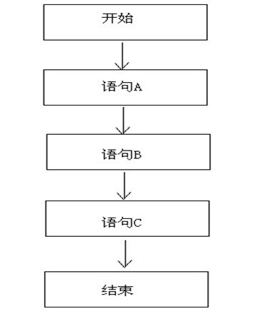
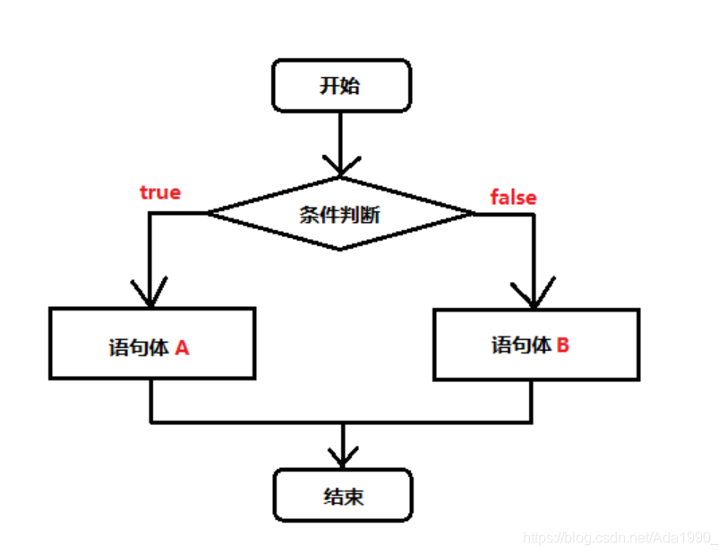
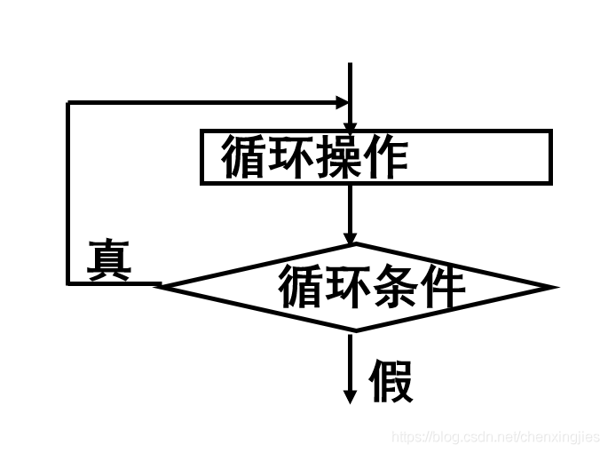
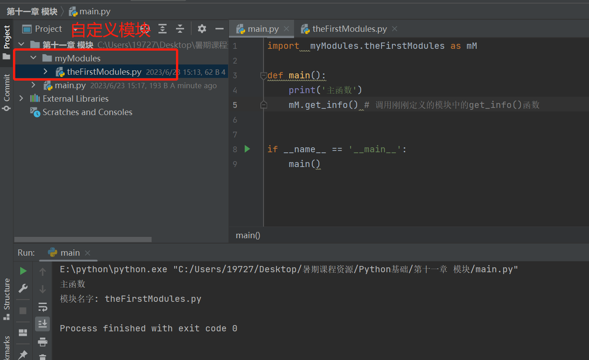
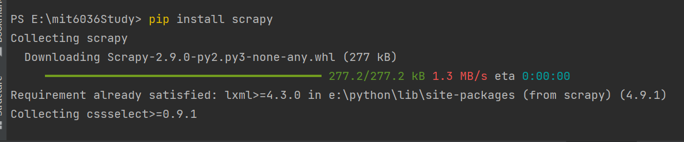
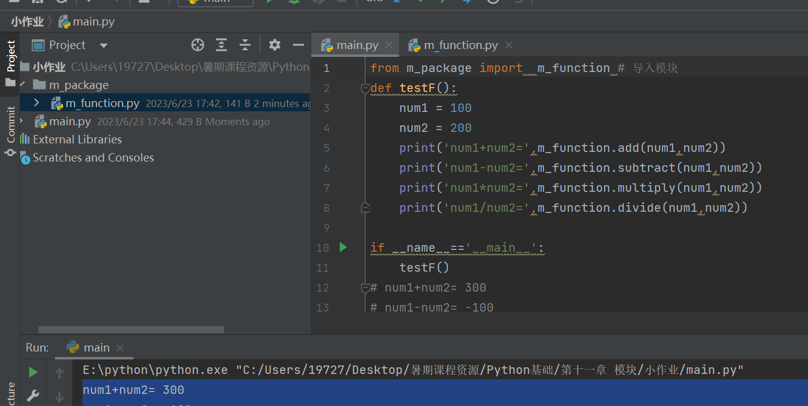

# Python基础

<h4 align="center">郑钦元</h4>

<h6 align="center">北京交通大学 2023年</h6>


## 第一章  Python输入和输出

### 1. 基本输入和输出


#### 1.1 使用`print()`函数输出

在Python中，使用内置的`print()`函数可以将结果输出到IDLE或标准控制台上，`print()`函数的基本语法如下：

```python
print(输出内容)
```

其中，输出内容可以是数字和字符串（字符串需要用引号括起来），此类内容将直接输出，也可以是包含运算符的表达式，此类内容将计算结果输出。例如:

```python
a = 100 # 变量a，值为100
b = 5 # 变量b，值为5

# print 练习
print(9) # 输出数字9
print(a) # 输出变量a的值为100
print(a*b) #输出a*b的结果为500
print("hello world") # 输出字符串
```

**注意**

在Python中，默认情况下，一条`print()`语句输出后会自动换行，如果想要一次输出多个内容，而且不换行，**可以将要输出的内容使用英文半角的逗号分隔**，例如：

```python
# 不换行==> 将要输出的内容使用英文半角的逗号分隔

a =100
b = 5
print(a,b,'hello world')
```


**ASCII码**

在编程时，我们输入的符号可以使用ASCII码的形式输入。ASCII码是美国信息交换标准码，最早只有127个字母被编码到计算机里，也就是英文大小写字母、数字和一些符号，这个编码表被称为ASCII编码，比如大写字母A的编码是65，小写字母a的编码是97.**通过ASCII码显示字符，需要使用`chr`函数进行转换**，例如:

```python
# 使用ASCII码输出
print('a') # 输出字符a
print(chr(97)) # 输出字符a（字符a的ASCII码是97）

print('A') # 输出字符A
print(chr(65)) # 输出字符A（字符A的ASCII码是65）
```


#### 1.2 使用`input()`函数输入

在Python中，使用内置函数`input()`可以接收用户的键盘输入，`input()`函数的基本用法如下：

```python
variable = input("提示文字")
```

其中，variable为保存输入结果的变量，双引号内的文字用于提示要输入的内容。例如，想要接收用户输入的内容，并保存到变量tip中，可以使用下面的代码：

```python
tip = input("请输入文字:")
```


**`ord()`函数**

前面介绍了使用ASCII码值输出相关字符，那么想要获得字符对应的ASCII码值应该如何实现呢？**通过`ord()`函数可以将字符的ASCII码值转换为数字，下面代码实现根据输入的字符，输出想要的ASCII值。**


```python
name = input("请输入字符:") # 输入字母或数字，不能输入汉字
print(name," 的ASCII码为: ",ord(name))
# 请输入字符:A
# A  的ASCII码为:  65
```

----

### 2. 注释

注释，是指在代码中对代码功能进行解释说明的标注性文字，可以提高代码的可读性。注释的内容将被Python解释器忽略，并不会在执行结果中体现出来。

在Python中，通常包括3种类型的注释，分别是**①单行注释、②多行注释和③中文声明注释**


#### 2.1 单行注释

在Python中，使用`#`作为单行注释的符号。从符号`#`开始直到换行为止，其后面所有的内容都作为注释的内容而被Python·编译器忽略，例如：

```python
print('hello world!') # 打印字符串

# 这也是注释
# 被编译器忽略
# 不会被执行
```

**单行注释可以放在要注释代码的前一行、也可以放在要注释代码的右侧**


#### 2.2 多行注释

在Python中，并没有一个单独的多行注释标记，而是将包含在一对三引号('''....''')或者('''''......''''')之间的代码都称为多行注释。这样子的代码解释器将忽略，由于这样的代码可以分为多行编写，所以也叫做多行注释，例如：

```python
# coding=utf-8
'''
演示多行注释，比如，这些内容都是会被编译器忽略的，
不会被执行的~，在这对三引号范围外的才会被执行
'''
print('hello world!') # 这是单行注释
```


#### 2.3 中文编码声明注释

在Python中编写代码的时候，如果用到指定字符编码类型的中文编码，需要在头文件开头加上中文声明注释，这样可以在程序中指定字符编码类型的中文编码，不至于出现代码错误。所以说，中文注释很重要。Python 3.x提供的中文注释声明语法格式如下:

```python
# -*- coding:编码 -*-
```

或者

```python
# coding=编码
```

例如保存文件编码格式为UTF-8，可以使用下面的中文编码声明注释：

```python
# -*- coding:utf-8 -*-
```

**说明**

在上面的代码中，`-*-`没有特殊的作用，只是为了美观才加上去的，所以上面的代码也可以使用`# coding:utf-8`代替

---


### 3.代码缩进

Python不像其他程序设计语言（如C语言或Java语言）采用大括号`{}`分隔代码块，而是采用代码缩进和冒号`:`区分代码之间的层次


**说明**

> 缩进可以使用空格键或者`<Tab>`键实现，使用空格键时，通常情况下采用4个空格作为一个缩进量，而使用`<Tab>`键时，则采用一个`<Tab>`键作为一个缩进量。通常情况下建议采用空格进行缩进。

​	在Python中，对于类定义、函数定义、流程控制语句，以及异常处理语句等，行尾的冒号和下一行的缩进表示一个代码块的开始，而缩进结束，则表示一个代码块的结束。例如，下面代码块的缩进是正确的缩进（若看不懂以下代码，没关系，后边会讲，你仅需要关注缩进本身这件事）：

```python
# coding:utf-8
def fun(x): # 判断x是否为素数
    x=int(x)
    if x<=1:
        return False
    else:
        for i in range(2,x):
            if x%i==0:
                return False
    return True

def main():
    x = int(input("输入一个正整数，判断是否为素数: "))
    if fun(x)==True:
        print(x,"是素数")
    else:
        print(x,"不是素数")

if __name__ == '__main__':
    main()
    
# 执行结果（例如输入4）
# 输入一个正整数，判断是否为素数: 4
# 4 不是素数
```

----

### 4. 编码规范

Python中采用PEP8作为编码规范，其中PEP是`Python Enhancement Proposal`的缩写，翻译过来就是Python增强建议书，而PEP8中的8表示版本号。PEP8是Python代码的样式指南。例如

* 每个import语句只导入一个模块，尽量避免一次导入多个模块

  * <a style="color:red">不推荐写法</a>

    ```python
    import os,sys
    ```

  * 推荐写法

    ```python
    import os
    import sys
    ```

* 不要在行尾添加`;`,也不要用分号将两条命令放在同一行，例如

  * <a style="color:red">不推荐写法</a>

    ```python
    height =float(input("请输入身高"));
    weight = float(input("请输入体重"));
    ```

* 建议每行不超过80个字符，如果超过，建议使用小括号`" "`将多行内容隐式连接起来，而不推荐使用反斜杠`\`进行连接，例如一个字符串文本在一行上显示不下，那么可以使用小括号`" "`将其分行显示

  * 推荐写法

    ```python
    print("hello ! I am Mike, nice to meet you!"
          "Nice to meet you, too!")
    ```

* 使用必要的空行可以增加代码的可读性

* 通常情况下，运算符两侧、函数参数之间，逗号两侧建议用空格分隔开

* 适当使用异常处理结构提高程序容错性，但不能过多依赖异常处理结构，适当的显示判断是必要的

### 5.命名规范

* 模块名尽量短小，并且全部使用小写字母，可以使用下划线分隔多个字母。例如，`game_main`,`game_register`,`bmiexponent`都是推荐使用的模块名称
* 包名尽量短小，并且全部使用小写字母，不推荐使用下划线
* 类名采用单词首写字母大写形式，例如，定义一个借书类，可以命名为`BorrowBook`
* 常量命名时全部采用大写字母，可以使用下划线


### 6. 练习题

#### （1）题目描述

要求输入一个正整数N，接下来N行，依次输入两个浮点型数字，输出它们之和。

**输入样例**

```
3
1.0 2.0
3.0 4.0
5.0 6.0
```

**输出样例**

```
3.0
7.0
11.0
```

#### （2）参考代码

```python
N=int(input()) # 输入正整数N
for i in range(0,N):
    x= float(input())
    y=float(input())
    print(x+y)
```

----


## 第二章 变量与基本数据类型

### 1.保留字与标识符

#### 1.1 保留字

保留字是Python语言中已经被赋予特定意义的一些单词，开发程序时，不可以把这些保留字作为变量、函数、类、模块和其他对象的名称来使用。Python的保留字如下表：

| 序号 |  保留字  | 序号 | 保留字 | 序号 |  保留字  |
| :--: | :------: | :--: | :----: | :--: | :------: |
|  1   |   and    |  2   |   as   |  3   |  assert  |
|  4   |  break   |  5   | class  |  6   | continue |
|  7   |   def    |  8   |  del   |  9   |   elif   |
|  10  |   else   |  11  | except |  12  | finally  |
|  13  |   for    |  14  |  from  |  15  |  False   |
|  16  |  global  |  17  |   if   |  18  |  import  |
|  19  |    in    |  20  |   is   |  21  |  lambda  |
|  22  | nonlocal |  23  |  not   |  24  |   None   |
|  25  |    or    |  26  |  pass  |  27  |  raise   |
|  28  |  return  |  29  |  try   |  30  |   True   |
|  31  |  while   |  32  |  with  |  33  |  yield   |

**注意**

Python中的所有保留字是区分字母大小写的，例如，True、if是保留字，但是TRUE、IF就不属于保留字。


**查看保留字**

可以通过`keyword.kwlist`查看Python中的保留字，例如:

```python
import keyword
print(keyword.kwlist)
# ['False', 'None', 'True', 'and', 'as', 'assert', 'async', 'await', 'break', 'class', 
#  'continue', 'def', 'del', 'elif', 'else', 'except', 'finally', 'for', 'from', 'global', 
#  'if', 'import', 'in', 'is', 'lambda', 'nonlocal', 'not', 'or', 'pass', 'raise', 'return',
#  'try', 'while', 'with', 'yield']
```

#### 1.2 标识符

标识符可以简单理解为一个名字，比如每个人都有自己的名字，它主要**用来标识变量、函数、类、模块和其他对象的名称**

Python语言标识符命名规则如下：

* 由字母、下划线`_`和数字组成，并且其第一个字符不能是数字，目前Python只允许使用ISO-Latin字符集中的字符A-Z和a-z
* 不能使用Python中的保留字

例如，下面是合法的标识符

```python
USERID
book
user_id # 保留字和其他字符组合是合法的标识符
book01 # 数字在标识符的后面是可以的
```

下面是非法的标识符：

```python
4work # 以数字开头
class # class是Python中的保留字
@book # 不能使用特殊字符@
book name # book和name之间包含了特殊字符空格
```

**注意**：Python标识符中不能包含空格、@、%和$等特殊字符

* 在Python中，标识符中的字母是严格区分大小的

* Python中以下划线开头的标识符有特殊意义，一般应避免使用相似的标识符

  * 以下划线开头的标识符（如_with)表示不能直接访问的类属性。另外，也不能通过" from xxx import"导入

  * 以双下划线开头的标识符（如__dd）表示类的私有成员

  * 以双下划线开头和结尾的是Python里专用的标识；例如，`__init()`表示构造函数

    

### 2. 变量

在Python中，不需要先声明变量名及其类型，直接赋值即可创建各种类型的变量。但是变量的命名并不是任意的，应遵循以下几条规则：

* 变量名必须是一个有效的标识符
* 变量名不能使用Python中的保留字
* 慎用小写字母1和大写字母O
* 应选择有意义的单词作为变量名


为变量赋值可以通过等号`=`来实现，其语法格式为：

```python
变量名 = value
```

**两个函数**

* `type()`函数：返回变量类型
* `id()`函数：返回变量的内存地址

```python
a = 100
print('变量a的值=',a)
print('变量a的内存地址=',id(a))
print('变量a的类型=',type(a))
# 变量a的值= 100
# 变量a的内存地址= 2574299827536
# 变量a的类型= <class 'int'>
```

---

### 3. 基本数据类型

在内存存储数据可以有多种类型。例如，一个人的姓名可以用字符串存储，年龄可以使用数值型存储、而婚否可以使用布尔类型存储。这些都是Python提供的基本数据类型。

#### 3.1 数字类型

在程序开发时，经常使用数字记录游戏的得分、网站的销售数据和网站的访问量等信息。在Python中，提供了数字类型用于保存这些数值，并且它们是不可改变的数据类型。如果修改数字类型变量的值，那么会先把该值存放在该内容中，然后修改变量让其指向新的内存地址。

##### （1）整数

整数用来标识整数数值，即没有小数部分的数值。在Python中，整数包括正整数、负整数和0。并且它的位数是任意的（当超过计算机自身的计算功能时，会自动转用高精度计算），如果要指定一个非常大的整数，只需要写出其所有位数即可。

整数类型包括十进制整数、八进制整数、十六进制整数和二进制整数。N进制数是“逢N进1”

##### （2）浮点数

浮点数由整数部分和小数部分组成，主要用于处理包括小数的数。例如3.14, 1.159, -1.3.浮点数也可以用科学计数法表示，例如2.3e2等

##### （3）复数

​	复数（Complex）是 Python 的内置类型，直接书写即可。换句话说，Python 语言本身就支持复数，而不依赖于标准库或者第三方库。**复数由实部（real）和虚部（imag）构成**，在 Python 中，复数的虚部以j或者J作为后缀，具体格式为：

```python
a+bj
```

具体例子如下：

```python
Num1 = 2+3j  # 第一个复数 2+3i
Num2 = 3+4j  # 第二个复数 3+4j
print('Num1+Num2=',Num1+Num2) # 复数加法
print('Num1-Num2=',Num1-Num2) # 复数减法
# Num1+Num2= (5+7j)
# Num1-Num2= (-1-1j)
```

---

#### 3.2 字符串类型

字符串就是连续的字符序列，可以是计算机所能表示的一切字符的集合。在Python中，通常使用单引号、双引号、三引号括起来，它们在语义上没有差别，只是在形式上有些差别。其中单引号和双引号必须在同一行、三引号可以分布在连续的多行上。例如：

```python
str1 = 'hello world!' # 用单引号括起来的字符串
str2 = "I am mike!"   # 用双引号括起来的字符串
str3 = '''
How are you?
I fine!
Thank you!.
'''                   # 用三引号括起来的字符串
print('str1=',str1)
print('str2=',str2)
print('str3=',str3)
```

Python中的字符串还支持**转义字符**，所谓的转义字符是指**使用`\`对一些特殊的字符进行转义**。常用的转义字符如下表：

| 转义字符 |                    说明                    |
| :------: | :----------------------------------------: |
|   `\`    |                   续行符                   |
|   `\n`   |                   换行符                   |
|   `\0`   |                     空                     |
|   `\t`   |     水平制表符，用于横向跳到下一制表位     |
|   `\"`   |                   双引号                   |
|   `\'`   |                   单元号                   |
|   `\\`   |                 一个反斜杠                 |
|   `\f`   |                    换页                    |
|  `\0dd`  |  八进制数，dd代表的字符，如`\012`代表换行  |
|  `\xhh`  | 十六进制数，hh代表的字符，如`\x0a`代表换行 |

例如:

```python
print("小明说: \" 你好呀，请问小红在家吗? \" \n \
       小红说:\" 我不在 \" ")
# 小明说: " 你好呀，请问小红在家吗? " 
#         小红说:" 我不在 " 
```

---


#### 3.3 布尔类型

布尔类型主要用来标识真或假的值。在Python中，标识符True和False被解释为布尔值。另外，**Python中的布尔值可以转换为数值，其中True表示1，False表示0**

布尔类型一般用于`if`语句的条件判断，例如:

```python
name = input()
if name == 'XiaoMing': # 如果是True
    print('name=',name)
else:                  # 如果是False
    print('name!=',name)
```


#### 3.4 数据类型转换

Python是动态类型的语言（也称为弱类型语言），虽然不需要先声明变量的类型，但有时候仍需要用到类型转换。在Python中，提供了如下表的函数进行个数据类型之间的转换

|          函数          |                       作用                       |
| :--------------------: | :----------------------------------------------: |
|        `int(x)`        |                将x转换为整数类型                 |
|       `float(x)`       |               将x转换成浮点数类型                |
| `complex(real,[imag])` |                   创建一个复数                   |
|        `str(x)`        |                 将x转换为字符串                  |
|       `repr(x)`        |              将x转换为表达式字符串               |
|      `eval(str)`       | 计算在字符串中的有效Python表达式，并返回一个对象 |
|        `chr(x)`        |              将整数x转换为一个字符               |
|        `ord(x)`        |         将一个字符x转换为它对应的整数值          |
|        `hex(x)`        |       将一个整数x转换为一个十六进制字符串        |
|        `oct(x)`        |       将一个整数x转换为一个八进制的字符串        |

### 4. Python内置进制转换函数

* `bin()`:将十进制整数转换为二进制字符串
* `oct()`:将十进制整数转换为八进制字符串
* `int()`:将任意进制转换为十进制
* `hex()`:将十进制整数转换为十六进制

### 5.练习题

#### （1）问题描述

要求输入一个十进制正整数N，分别输出它的二进制数、八进制数、十六进制数。

**输入样例**

```
13
```

**输出样例**

```
十进制整数N= 13
它的二进制数= 0b1101
它的八进制数= 0o15
它的十六进制数= 0xd
```

#### （2）参考代码

```python
N=int(input()) # 输入一个十进制整数N
print('十进制整数N=',N)
print('它的二进制数=',bin(N))
print('它的八进制数=',oct(N))
print('它的十六进制数=',hex(N))
# 13
# 十进制整数N= 13
# 它的二进制数= 0b1101
# 它的八进制数= 0o15
# 它的十六进制数= 0xd
```


---

## 第三章 运算符

​	运算符是一些特殊的符号，主要用于数学计算，比较大小和逻辑运算。Python的运算符主要包括**算术运算符、赋值运算符、比较（关系）运算符、逻辑运算符和位运算符**。 使用运算符将不同类型的数据按照一定的规则连接起来的式子，称为表达式。例如，使用算术运算符连接起来的式子称为算术表达式，使用逻辑运算符连接起来的式子称为逻辑表达式。


### 1. 算术运算符

算术运算符是处理四则运算的符号，在数字的处理中应用得最多。常用的算术运算符如下表：

| 运算符 |            说明            | 实例 | 结果 |
| :----: | :------------------------: | :--: | :--: |
|   +    |             加             | 1+1  |  2   |
|   -    |             减             | 3-4  |  -1  |
|   *    |             乘             | 3*4  |  12  |
|   /    |             除             | 7/2  | 3.5  |
|   %    |   求余，即返回除法的余数   | 7%2  |  1   |
|   //   | 取整除，即返回商的整数部分 | 7//2 |  3   |
|   **   |     幂，即返回x的y次方     | 2**4 |  16  |

**注意**：使用除法(`/`或`//`)运算符和取余运算符时，除数不能为0，否则将会出现异常


在Python中，`*`运算符还可以用于字符串中，计算结果就是字符串重复指定次数的结果。例如：

```python
a = 1+1  # 加法
b = 3*4  # 乘法
c = 100-12 # 减法
d = 7/2    # 除法
e = 7//2   # 整除
f = 7%2    # 取余
print('a=',a)
print('b=',b)
print('c=',c)
print('d=',d)
print('e=',e)
print('f=',f)
# *运算符用于字符串输出
print('M'*10) # 输出10个M
print('@'*10) # 输出10个@
print(' '*10,'M'*5) # 先输出10个空格，再输出5个M
```


### 2.赋值运算符

赋值运算符主要用来为变量等赋值。使用时，可以直接把基本赋值运算符`=`右边的值赋给左边的变量，也可以进行某些运算后再赋值给左边的变量。在Python中常用的赋值运算符如下表：

| 运算符 |      说明      | 举例  | 展开形式 |
| :----: | :------------: | :---: | :------: |
|  `=`   | 简单的赋值运算 |  x=y  |   x=y    |
|  `+=`  |     加赋值     | x+=y  |  x=x+y   |
|  `-=`  |     减赋值     | x-=y  |  x=x-y   |
|  `*=`  |     乘赋值     | x*=y  |  x=x*y   |
|  `/=`  |     除赋值     | x/=y  |  x=x/y   |
|  `%=`  |    取余赋值    | x%=y  |  x=x%y   |
| `**=`  |     幂赋值     | x**=y |  x=x**y  |
| `//=`  |   取整除赋值   | x//=y |  x=x//y  |

例如:

```          python
x=int(input()) # 输入一个整数x
x+=10          # 将x加10
print(x)       # 输出x
```

---

### 3. 比较（关系）运算符

比较运算符，也称为关系运算符。用于对变量或表达式的结果进行大小、真假等比较。如果比较结果为真，则返回True，若为假，则返回False。比较运算符通常在条件语句中作为判断的依据。python中的比较运算符如下表：

| 运算符 |    作用    |   举例   | 结果  |
| :----: | :--------: | :------: | :---: |
|  `>`   |    大于    | 'a'>'b'  | False |
|  `<`   |    小于    | 145<212  | True  |
|  `==`  |    等于    | 'c'=='c' | True  |
|  `!=`  |   不等于   | 'y'!='c' | True  |
|  `>=`  | 大于或等于 |  477>1   | True  |
|  `<=`  | 小于或等于 |   2<=2   | True  |

### 4. 逻辑运算符

逻辑运算符是对真和假两种布尔值进行运算，运算后的结果仍是一个布尔值，python中的逻辑运算符主要包括`and()`（逻辑与），`or()`（逻辑或）、`not()`（逻辑非），下标列出了逻辑运算符的用法和说明。

| 含义  | 运算符 |    用法     | 结合方向 |
| :---: | :----: | :---------: | :------: |
| `and` | 逻辑与 | op1 and op2 | 从左到右 |
| `or`  | 逻辑或 | op1 or op2  | 从左到右 |
| `not` | 逻辑非 |   not op    | 从右到左 |

例如：

```python
score = int(input())

if score >=0 and score <=100:  # 逻辑与 运算
    print('分数是有效范围')
else:
    print('分数是无效范围')

score_xiaoming = 71
score_xiaohong = 30

if score_xiaohong>=60 or score_xiaoming>=60: # 逻辑或 运算
    print('小明和小红其中有一个人及格了')
else:
    print('小明和小红分数都没有及格')
```


### 5. 位运算符

​	位运算符是把数字看做二进制数来进行计算的，因此，需要将要执行运算的数据转换为二进制。然后才能执行运算。Python中的位运算符有**位与`&`, 位或`|`, 位异或`^`, 取反`~`

* **“位与”运算**： 两个操作的二进制数，对于每一位，**同为1时则为1，其他情况为0**
* **“位或”运算**：对于两个操作的二进制数，对于每一位，**只要一个为1，则为1；若两个都为0，则为0**
* **”位异或”运算**：看是否**不同**，**若不同，则为1，否则为0**
* **“位取反”运算**：对于一个操作数的二进制数，**将1变为0，0变为1**
* **左移运算符**：左移运算符`<<`是将一个二进制操作数向左移动指定的位数，左边（高位端）溢出的位被丢弃，右边（低位端）的空位用0补充，左移位运算**相当于乘以2的n次幂**
* **右移运算符**：右移运算符`>>`是一个将二进制操作数向右移动指定的位数，右边（低位端）溢出的位被丢弃，而在填充左边（高位端）的空位时，如果最高位是0（正数），左侧空位填入0；如果最高位是1（负数），左侧空位填入1。**右移位运算相当于除以2的n次幂**

例子:

```python
a = 110
b = 111
print("Num1=",bin(a)[2:]) # 因为bin函数以0b开头，从第三位开始才是二进制数
print("Num2=",bin(b)[2:])
print("【1】位与 运算\n Num1 & Num2 = ", bin(a&b)[2:]) # 按位与：两个都为1，结果才为1
print("【2】位或 运算\n Num1 | Num2 = ", bin(a|b)[2:]) # 按位或：有一个为真，则为真；若都为假，才是假
print("【3】异或 运算\n Num1 ^ Num2 = ", bin(a^b)[2:]) # 按位异或：是否为不同？是为真，否则为假
print("【4】对Num1进行位取反操作：")
print("Num1 =",bin(a)[2:])
print("~Num1=",bin(~a)) # 将对应的1改成0,0改成1

#######################################

# 左移： 相当于乘以2的n次幂
num = 10
print('num=',num)
num = num<<3  # 左移三位，相当于乘以2**3 =8，结果为80
print('num<<3:',num)
# 右移： 相当于除以2的n次幂
num = num>>3
print('num>>3:',num)
```

执行结果如下：

```
Num1= 1101110
Num2= 1101111
【1】位与 运算
 Num1 & Num2 =  1101110
【2】位或 运算
 Num1 | Num2 =  1101111
【3】异或 运算
 Num1 ^ Num2 =  1
【4】对Num1进行位取反操作：
Num1 = 1101110
~Num1= -0b1101111
num= 10
num<<3: 80
num>>3: 10
```


### 6.运算符的优先级

所谓的运算符的优先级，是指应用中哪一个运算符先计算，哪一个后计算，与数学的四则运算符遵循的“先乘除，后加减”是一个道理。

Python运算符的运算规则是：优先级高的运算先执行，优先级低的运算后执行，同一优先级的操作按照从左到右的顺序进行。也可以像四则运算那样使用小括号，括号内的运算最先执行。下表按**从高到低**的顺序列出了运算符的优先级。同一行中的运算符具有相同优先级，此时它们的结合方向决定求职顺序。

|               运算符               |          说明          |
| :--------------------------------: | :--------------------: |
|                `**`                |           幂           |
|           `~`, `+` , `-`           |    取反、正号和负号    |
|        `*`, `/`, `%`, `//`         |       算术运算符       |
|              `+`, `-`              |       算术运算符       |
|             `<<`, `>>`             | 位运算符中的左移和右移 |
|                `&`                 |    位运算符中的位与    |
|                `^`                 |   位运算符中的位异或   |
|                `|`                 |    位运算符中的位或    |
| `<`, `<=` ,`>`, `>=` , `!=` , `==` |       比较运算符       |

**注意**

在编写程序时尽量使用括号`()`来限定运算次序，以免运算次序发生错误


### 7. 练习题

#### （1）问题描述

要求输入一个正整数N，输入一个正整数M；

接下来N行，依次输入数字，要求统计所有在区间[0，1000]以内的数字（注意，输入的是正整数）的**和乘以2的M次幂**（尽量使用本节课讲的内容）

**输入样例**

```
3
2
123
872
322
```

**输出样例**

```
5268
```

---


#### （2）参考代码

```python
N = int(input()) # 正整数N,表示接下来输入多少个数字
M = int(input()) # 2的m次幂
sum = 0 # 统计合法区间[-1000,1000]内数字之和

for i in range(0, N):
    x = int(input()) # 输入正整数
    sum += x

sum <<= M  # 左移M位，表示乘以2的M次幂
print(sum)

```

---


## 第四章 列表和元组

在数学里，序列也称为数列，是指按照一定顺序排列的一列数，而在程序设计中，序列是一种常用的数据存储方式，几乎每一种程序设计语言都提供了类似的数据结构。例如，C语言或者Java中的数组等。

在Python中序列是最基本的数据结构，它是一块用于存放多个值的连续内存空间。**Python中内置了5个常用的序列结构，分别是列表、元组、集合、字典和字符串。**本章将详细介绍序列、列表和元组的使用方法。


### 1. 序列

序列是一块用于存放多个值的连续内存空间，并且按照一定顺序排序，每一个值（称为元素）都分配一个数字，称为索引或位置。通过该索引可以取出相应的值。例如，我们可以把一家酒店看做一个序列，那么酒店里的每个房间都可以看做是这个序列的元素，而房间号就相当于索引，可以通过房间号找到相应的房间。

在Python中，序列结构主要有**列表、元组、集合、字典和字符串**。对于这些序列结构，主要有以下几个操作：


#### 1.1 索引

序列中的每个元素都有一个编号，也称为索引。**这个索引是从0开始递增的**，即下标为0表示第一个元素，下标

为1表示第二个元素，以此类推。

```
元素 ：  元素1   元素2   元素3  .....   元素n
下标 :   0       1      2     .....    n-1
```

Python比较神奇，**它的索引可以是负数**。**这个索引从右往左计数，也就是从最后一个数开始计数，即最后一个元素的索引值是-1，倒数第二个数的索引值是-2，依次类推**


**注意**

> 在采用复数作为索引值时，是从-1开始的，而不是从0开始的，即最后一个元素的下标是-1，而不是0，这是为了防止与第一个元素重合

通过索引可以访问序列中的任何一个元素，例如（以下以列表为例子）：

```python
name = ['小明','小红','小李','小郑','小赵']
print('第一个名字是:',name[0])
print('第二个名字是:',name[1])

print('倒数第一个名字是:',name[-1])
print('倒数第二个名字是:',name[-2])
# 第一个名字是: 小明
# 第二个名字是: 小红
# 倒数第一个名字是: 小赵
# 倒数第二个名字是: 小郑
```


#### 1.2 切片

切片操作是访问序列中元素的另外一种方法，**它可以访问一定范围内的元素**，通过切片操作，可以生成一个新的序列。实现切片操作的语法格式如下：

```
sname [start : end : step]
```

**参数说明**

* sname: 表示序列的名称
* start: 表示切片开始的位置**（包括该位置）**，如果不指定，则默认为0
* end : 表示切片结束的位置**（不包括这个位置）**，如果不指定，则默认为该序列的长度
* step : 表示切片的步长，如果省略，则默认为1，当省略步长时，最后一个冒号也可以省略


**说明**

> 在进行切片操作时，如果指定了步长，那么将按照该步长遍历序列的元素，否则将一个一个遍历序列。
>
> 如果想要复制整个序列，可以将start和end参数都省略，但是中间的冒号需要保留，例如，name[:]就表示复制整个名称为name的序列

例如：

```python
num = [1,2,3,4,5,6,7,8,9,10,11,12,13,14,15,16,17,18,19,20]

print('num=',num[:]) # 访问num的全部元素
num1 = num[0::2] # 以1为首元素，公差为2的等差数列
print('num[0::2]=',num1)
num2 = num[::3] # 以3为公差的等差数列
print('num[::3]=',num2)
# num= [1, 2, 3, 4, 5, 6, 7, 8, 9, 10, 11, 12, 13, 14, 15, 16, 17, 18, 19, 20]
# num[0::2]= [1, 3, 5, 7, 9, 11, 13, 15, 17, 19]
# num[::3]= [1, 4, 7, 10, 13, 16, 19]
```


#### 1.3 序列相加

在Python中，支持两种**相同类型（如都为列表、元组、集合、字符串或字典等）**相加操作，即**将两个序列进行连接**<a style="color:red">不是指序列中的元素相加</a>,使用`+`运算符实现。

例如：

```python
name = ['学生-小明','学生-小红','学生-小蓝']

teacher = ['老师-王老师','老师-李老师','老师-张老师']

print(name+teacher) # 序列的相加操作，将两个序列拼接起来

# ['学生-小明', '学生-小红', '学生-小蓝', '老师-王老师', '老师-李老师', '老师-张老师']
```

#### 1.4 乘法

在Python中，使用数字n乘以一个序列会生成新的序列。**新序列的内容为原来序列重复n次的结果**。例如：

```python
name = ['学生-小明','学生-小红','学生-小蓝']

new_name = name * 3 # 将name这个序列重复三次生成新的序列
print(new_name)
# ['学生-小明', '学生-小红', '学生-小蓝', '学生-小明', '学生-小红', '学生-小蓝', '学生-小明', '学生-小红', '学生-小蓝']
```


#### 1.5 检查某个元素是否是序列的成员（元素）

在Python中，可以使用关键字`in`检查某个元素是否为序列的成员，即检查某个元素是否包含在该序列中。该语法格式如下：

```
value in sequence
```

其中，value为要检查的元素，sequence表示指定的序列。

例如：

```python
teacher = ['王老师','李老师','张老师','马老师']

if '王老师' in teacher:
    print('王老师在序列中!')
else:
    print('王老师不在序列中!')

if '马云' in teacher:
    print('马云在序列中!')
else:
    print('马云不在序列中!')
    
# 王老师在序列中!
# 马云不在序列中!
```

#### 1.6 计算序列的长度、最大值和最小值

在Python中，提供了内置函数计算序列的长度、最大值和最小值。分别是：使用`len()`函数计算序列的长度，即返回序列包含了多少个元素；使用`max()`函数返回序列中的最大元素；使用`min()`函数返回序列中的最小元素。

除了上面介绍的三个内置函数，Python还提供了如下表的内置函数：

|     函数      |                   说明                    |
| :-----------: | :---------------------------------------: |
|   `list()`    |             将序列转换为列表              |
|    `str()`    |            将序列转换为字符串             |
|    `sum()`    |                计算元素和                 |
|  `sorted()`   |              对元素进行排序               |
| `reversed()`  |             反向序列中的元素              |
| `enumerate()` | 将序列组合为一个索引序列，多用在for循环中 |

**例子**

```python
num = (5,10,1,42,35,40,21,13,2,49)  # num是一个元组
print('元组num= ',num)
num = list(num)  #  将num转换为列表
print('将num转换为列表，num=',num)

print('num的长度, len(num)=',len(num))
print('将列表num排序后的结果为:',sorted(num))
num=sorted(num)
print('列表中的元素之和为:',sum(num))
# 元组num=  (5, 10, 1, 42, 35, 40, 21, 13, 2, 49)
# 将num转换为列表，num= [5, 10, 1, 42, 35, 40, 21, 13, 2, 49]
# num的长度, len(num)= 10
# 将列表num排序后的结果为: [1, 2, 5, 10, 13, 21, 35, 40, 42, 49]
# 列表中的元素之和为: 218
```

---

### 2. 列表

Python中的列表和歌曲列表类似，也是由一系列按特定顺序排列的元素组成的。它是Python中内置的可变序列。在形式上，列表的所有元素都放在一对中括号`[]`中，两个相邻元素使用逗号分隔开。在内容上，**可以将整数、实数、字符串、列表、元组等任何类型的内容放入到列表中，并且同一个列表中，元素的类型可以不同，因为它们之间没有任何关系。**Python的列表是灵活的，这一点与其他编程语言不同。


#### 2.1 列表的创建和删除

在Python中提供了多种创建列表的方法

* 使用赋值运算符直接创建列表，具体语法格式如下：

  ```python
  listname = [element1, element2,element3]
  ```

  其中,listname是列表的名称，可以是任何符合Python命名规则的标识符，element表示元素，没有个数显示

* 创建空列表，如:

  ```python
  emptylist = []
  ```

* 创建数值列表。例如，在Python中，可以使用`list()`函数直接将`range()`函数循环出来的结果转换为列表


**删除列表**

对于已经创建的列表，不再使用时，可以使用`del`语句将其删除

>del语句在实际开发时，并不常用。因为Python自带的垃圾回收机制会自动销毁不用的列表，所以即使我们不手动将其删除，Python也会自动将其回收。

**例子**

```python
num = list(range(0,20,2)) # 创建数值列表
print(num)
# [0, 2, 4, 6, 8, 10, 12, 14, 16, 18]
del num # 删除列表
```


#### 2.2 访问列表元素

在Python中，如果想将列表的内容输出也比较简单，可以直接使用`print()`函数。也可以通过上文所说的切片和下标访问。

```python
num = [1,2,3,4,5,6,7,8,9,10,11,12,13,14,15,16,17,18,19,20]

print('num=',num) # 输出整个列表

print('num=',num[:]) # 访问num的全部元素
num1 = num[0::2] # 以1为首元素，公差为2的等差数列
print('num[0::2]=',num1)
num2 = num[::3] # 以3为公差的等差数列
print('num[::3]=',num2)
# num= [1, 2, 3, 4, 5, 6, 7, 8, 9, 10, 11, 12, 13, 14, 15, 16, 17, 18, 19, 20]
# num= [1, 2, 3, 4, 5, 6, 7, 8, 9, 10, 11, 12, 13, 14, 15, 16, 17, 18, 19, 20]
# num[0::2]= [1, 3, 5, 7, 9, 11, 13, 15, 17, 19]
# num[::3]= [1, 4, 7, 10, 13, 16, 19]
```

#### 2.3 遍历列表

遍历列表中的所有元素是常用的一种操作，在遍历的过程中可以完成查询，处理等功能。在Python中遍历列表的方法有很多，下面介绍两种常用的方法：

##### （1）直接使用for循环实现

直接使用for循环遍历列表，只能输出元素的值，它的语法格式如下：

```python
for item in listname:
    # 输出item
```

其中，item用于保存获取到的元素值，要输出元素内容时，直接输出该变量即可；listname为列表名称。例如：

```python
# 求1~100累加和
sum = 0 # 记录结果
num = list(range(0,100+1))
print(num)

# 遍历列表
for i in num:
    sum += i

print('1~100累加和=',sum)
```

##### （2）使用for循环和`enumerate()`函数实现

使用for循环和`enumerate()`函数可以实现同时输出索引值和元素内容的功能，语法格式如下：

```python
for index,item in enumerate(listname):
    # 输出index和item
```

**参数说明**

* index：用于保存元素的索引
* item用于保存获取到的元素值，要输出元素内容时，直接输出该变量即可
* listname为列表名称

**例如**

```python
print('2018年俄罗斯世界杯四强：')
team = ['法国','比利时','英格兰','克罗地亚']
for index,item in enumerate(team):
    print(index+1,item)
    
# 2018年俄罗斯世界杯四强：
# 1 法国
# 2 比利时
# 3 英格兰
# 4 克罗地亚
```

---

#### 2.4 添加、修改和删除列表元素

添加、修改和删除列表元素也称为更新列表。在实际开发时，经常需要对列表进行更新。


##### （1）添加元素

在序列章节中，介绍了可以通过`+`号将两个序列连接，通过该方法也可以实现为列表添加元素，但是这种方法的执行速度要比直接使用列表元素的`append()`方法慢，所以建议在实现添加元素操作中使用`append()`方法。

语法格式如下:

```python
listname.append(obj)
```

其中,listname为列表的名称，obj为待添加的元素.

​	如果想要将一个列表中的全部元素添加到另外一个列表中，可以使用列表对象的`extend()`方法实现，语法格式如下：

```python
listname.extend(seq)
```

其中，listname为原列表，seq为要添加的列表。语句执行后，seq的内容将追加到listname的后面。例如：

```python
num = [1,2,3]  # 原始列表
num2 = [3,4,5]
num.extend(num2)  # 将num2的内容全部追加到num中
print('num=',num)
num.append(9) # 追加单个元素
print('num=',num)
# num= [1, 2, 3, 3, 4, 5]
# num= [1, 2, 3, 3, 4, 5, 9]
```

##### （2）修改元素

修改列表中的元素只需要通过索引获取该元素，然后再为其重新赋值即可。例如:

```python
num = ['小明','小王','小李']
num[1]='马斯克' # 将小王修改为马斯克
print('num=',num)
# num= ['小明', '马斯克', '小李']
```

##### （3）删除元素

删除元素主要有两种情况，一是根据索引删除，另外一种是根据元素值进行删除。

* 根据索引删除。例如:

  ```python
  num = ['小明','小王','小李','小陈']
  
  del num[1] # 删除第二个元素 小王
  print('删除第二个元素 小王, num=',num)
  del num[-2] # 删除倒数第二个元素小李
  print('删除倒数第二个元素小李, num=',num)
  # 删除第二个元素 小王, num= ['小明', '小李', '小陈']
  # 删除倒数第二个元素小李, num= ['小明', '小陈']
  ```

* 根据元素删除，例如:

  ```python
  num = ['小明','小王','小李','小陈']
  print('原始列表,num=',num)
  # 通过remove函数进行删除操作
  if num.count('小王'):  # 先判断一下这个元素是否存在
      num.remove('小王')
  
  print('删除小王后的列表，num=',num)
  # 原始列表,num= ['小明', '小王', '小李', '小陈']
  # 删除小王后的列表，num= ['小明', '小李', '小陈']
  ```

  **说明**

  >列表对象的`count()`方法用于判断指定元素出现的次数，返回结果为0时，表示不存在该元素。

---

#### 2.5 对列表进行统计计算

Python的列表提供了内置的一些函数来实现统计、计算方面的功能，下面介绍常用的功能：

##### （1）获取指定元素出现的次数

使用列表对象的`count()`方法可以获取指定元素在列表中的出现次数，基本语法格式如下：

```python
listname.count(obj)
```

**参数说明**

* listname:表示列表的名称
* obj:表示要判断是否存在的对象，这里只能精确匹配，即不能是元素值的一部分
* 返回值：元素在列表中出现的次数

##### （2）获取指定元素首次出现的下标

使用列表对象的`index()`方法可以获取指定元素在列表中首次出现的位置（即索引）。基本语法格式如下：

```python
listname.index(obj)
```

**参数说明**

* listname: 表示列表的名称
* obj: 表示要查找的对象，这里只能进行精确匹配。如果指定的对象不存在时，则抛出异常
* 返回值：首次出现的索引值

例如：

```python
num = ['小明','小王','小李','小陈','小王']

if num.count('小王')!=0:
    print('小王第一次出现的下标是: ', num.index('小王'))
else:
    print('小王没有出现')
    
# 小王第一次出现的下标是:  1
```

##### （3）统计数值列表的元素和

在Python中，提供了`sum()`函数用于统计数值列表中各元素的和，语法格式如下:

```python
sum(iterable[,start])
```

**参数说明**

* iterable: 表示要统计的列表
* start:表示统计结果是从哪个数开始（即将统计结果加上start所指定的数），是可选参数，如果没有指定，默认值为0

```python
# 给定一个列表，元素是从1~100，要求使用sum函数统计1~50之和
num = list(range(1,100+1))
print('原始列表 num= ',num)
result =0 # 用于统计1~50的累加和
result = sum(num[:50])
print('1~50的累加和是: ',result)
```

#### 2.6 对列表进行排序

在实际开发时，经常需要对列表进行排序。Python中提供了两种常用的对列表进行排序的方法：使用列表对象的`sort()`方法和使用内置的`sorted()`函数

##### （1）使用列表对象的`sort()`方法实现

列表对象提供了`sort()`方法对原列表中的元素进行排序。排序后原列表中的元素顺序将发生改变。语法格式如下:

```python
listname.sort(key=None,reverse=False)
```

**参数说明**

* listname: 表示要进行排序的列表
* key:表示指定从每个列表元素中提取一个用于比较的键（例如，key=str.lower表示在排序时不区分字母大小写）
* reverse:可选参数，如果将其值指定为True，则表示降序排列，如果为False，则表示升序排序。默认为升序排序.

**例子**:

```python
grade = [90,34,76,57,22,89,93,45]
print('原列表:',grade)
grade.sort()
print('升序排序:',grade)
grade.sort(reverse=True)
print('降序排序:',grade)
# 原列表: [90, 34, 76, 57, 22, 89, 93, 45]
# 升序排序: [22, 34, 45, 57, 76, 89, 90, 93]
# 降序排序: [93, 90, 89, 76, 57, 45, 34, 22]
```

**说明**

>采用sort()方法对列表进行排序时，对中文支持不好，排序结果与我们常用的音序排序法活笔画排序法不一致。如果需要对中文内容的列表进行排序，还需要重新编写我们相应的方法进行处理，不能直接使用sort()函数


##### （2）使用内置的`sorted()`函数实现

在Python中，提供了一个内置的`sorted()`函数，用于对列表进行排序。使用该函数进行排序后，原列表的顺序不变。语法格式如下:

```python
sorted(iterable,key=None,reverse=False)
```

**参数说明**

* iterable: 表示要进行排序的列表
* key：用于指定排序规则
* reverse:可选参数，如果为True，表示降序，否则为升序排序；

**例子**

```python
grade = [90,34,76,57,22,89,93,45]
print('原列表:',grade)
print('升序排序:',sorted(grade))
print('降序排序:',sorted(grade,reverse=True))
# 原列表: [90, 34, 76, 57, 22, 89, 93, 45]
# 升序排序: [22, 34, 45, 57, 76, 89, 90, 93]
# 降序排序: [93, 90, 89, 76, 57, 45, 34, 22]
```

**说明**

>列表对象的`sort()`方法和内置的`sorted()`函数的作用基本相同，所不同的就是使用`sort()`方法时，会改变原列表的元素排列顺序，而使用`sorted()`函数时，会建立一个原列表的副本，该副本为排序或的列表。


#### 2.7 列表推导式

使用列表推导式可以快速生成一个列表，或者根据某个列表生成满足指定需求的列表。列表推导式通常有以下几种常用的语法格式:

##### （1）生成指定范围的数值列表

语法格式如下：

```
list  = [Expression for var in range]
```

**参数说明**

* list: 表示生成的列表名称
* Expression: 表达式，用于计算新列表的元素
* var: 循环变量
* range: 采用`range()`函数生成的range对象

例如，要生成一个包括10个随机数的列表，要求数的范围在10~100（包括）之间，具体代码如下:

```python
import  random # 导入random标准库
randomnumber = [random.randint(10,100) for i in range(10)]
print("生成的10个随机数为:",randomnumber)
# 生成的10个随机数为: [43, 93, 68, 23, 45, 22, 43, 23, 12, 42]
```


##### （2）根据列表生成指定需求的列表

语法格式如下：

```
newList = [Expression for var in list]
```

**参数说明**

* newList :表示新生成的列表名称
* Expression: 表达式，用于计算新列表的元素
* var: 变量，值为后面列表的每个元素值
* list: 用于生成新列表的原列表

例如:

```python
price = [1200,5400,6200,1998,8888]
sale = [int(x*0.5) for x in price]
print('原价格为: ',price)
print('打五折的价格为:',sale)
# 原价格为:  [1200, 5400, 6200, 1998, 8888]
# 打五折的价格为: [600, 2700, 3100, 999, 4444]
```

##### （3）从列表中选择符合条件的元素组成新的列表

语法格式如下:

```
newList = [Expression for var in list if condition]
```

**参数说明**

* newList:表示新生成的列表名称
* Expression:表达式，用于计算新列表的元素
* var: 变量，值为后面列表的每个元素值
* list:用于生成新列表的原列表
* condition: 条件表达式，同于指定筛选条件


例如：使用列表推导式生成一个商品价格高于5000的列表

```python
price = [1200,5400,6200,1998,8888]
sale = [x for x in price if x>5000]
print('原价格:',price)
print('高于5000的价格:',sale)
# 原价格: [1200, 5400, 6200, 1998, 8888]
# 高于5000的价格: [5400, 6200, 8888]
```

---


### 3. 元组

元素(tuple)是Python中另外一个重要的序列结构，与列表类似，也是由一系列按特定顺序排列的元素组成，但是它是不可变序列。因此，元组也可以称为不可变的列表。在形式上，元组的所有元素都放在一对`()`中，两个相邻元素使用逗号`,`分隔。在内容上，可以将整数、实数、字符串、列表、元组等任何类型的内容放入到元组中，并且在同一个元组中，元素的类型可以不同，因为它们之间没有任何关系。通常情况下，**元组用于保存程序中不可修改的内容**。

**说明**

>从元组和列表的定义上看，这两种结构比较相似，那么它们之间有哪些区别呢。它们之间主要的区别就是元组是不可变序列，列表是可变序列。即**元组中的元素是不可以单独修改，而列表则可以任意修改。**

#### 3.1 元组的创建和删除

在Python中提供了多种创建元组的方法，下面分别介绍。

##### （1）使用赋值运算符直接创建元组

同其他类型的Python变量一样，创建元组时，也可以使用赋值运算符`=`直接将一个元组赋值给变量，语法格式如下:

```python
tuplename = (element1,element2,element3)
```

其中，tuplename表示元组的名称，可以是任何符合Python命名规则的标识符，element1,element2表示元组中的元素，个数没有限制，并且只要是Python支持的数据类型就可以。

**注意**

>创建元组的语法与创建列表的语法类似，只是创建列表时使用的是`[]`，而创建元组时使用的是`()`

**例子**

```python
tupleName = ('小明',3.1415926,True)
print('创建的元组:',tupleName)
print('type(tupleName)=',type(tupleName))
# 创建的元组: ('小明', 3.1415926, True)
# type(tupleName)= <class 'tuple'>
```


##### （2）创建空元组

在Python中，也可以创建一个空元组，空元组可以应用在为函数传递一个空值或者返回空值时。例如，定义一个函数必须传递一个元组类型的值，而我们还不想为它传递一组数据，那么就可以创建一个空元组传递给它

```python
tupleName=()
```


##### （3）创建数值元组

在Python中，可以使用`tuple()`函数直接将range()函数循环出来的结果转换为数值元组。tuple()函数语法格式如下:

```python
tuple(data)
```

其中，data表示可以转换为元组的数据，其类型可以是range对象，字符串，元组或者其他可迭代类型的数据。

例如，创建一个10~20之间（不包括20）所有偶数的元组，可以使用下面的代码:

```python
tupleName2 = tuple(range(10,20,2))
print('创建的数值元组为: ',tupleName2)
# 创建的数值元组为:  (10, 12, 14, 16, 18)
```


**说明**

>使用`tuple()`函数不仅能通过range对象创建元组，还可以通过其他对象创建元组


##### （4）删除元组

对于已经创建的元组，不再使用时，可以使用`del`语句将其删除，语法格式如下:

```python
del tupleName
```

其中,tupleName为要删除的元组的名称

例如:

```python
tupleName = ('小明',3.1415926,True)
del tupleName # 删除元组
```


#### 3.2 访问元组元素

在Python中，如果想将元组的内容输出也比较简单，可以直接使用`print()`函数即可。在输出元组时，如果不想输出元组的全部内容，**也可以通过元组的索引获取指定的元素**。另外，**对于元组也可以采用切片方式获取指定的元素**。例如：

```python
tupleName = ('小明',3.1415926,True,211,False,'小王') # 定义元组

print('元组的全部元素=',tupleName)
print('元组的第一个元素=',tupleName[0])
print('元组的倒数第二个元素=',tupleName[-2])
print('元组的前三个元素=',tupleName[:3])
print('元组的最后4个元素=',tupleName[-4:])
# 元组的全部元素= ('小明', 3.1415926, True, 211, False, '小王')
# 元组的第一个元素= 小明
# 元组的倒数第二个元素= False
# 元组的前三个元素= ('小明', 3.1415926, True)
# 元组的最后4个元素= (True, 211, False, '小王')
```


#### 3.3 修改元组元素

元组是不可变序列，**所以不能对它的单个元素进行修改。** 但是元组也不是完全不能修改，我们可以对元组进行重新赋值。例如，下面的代码是允许的

```python
tupleName = ('小明',3.1415926,True) # 定义元组
print('原始元组=',tupleName)
tupleName=(1,2,3) # 对元组进行重新赋值
print('新元组=',tupleName)
# 原始元组= ('小明', 3.1415926, True)
# 新元组= (1, 2, 3)
```

从上面结果看出，元组的值已经改变。另外，还可以对元组进行**连接组合**。例如，可以使用下面的代码实现已经存在的元组结尾处添加一个新元组。

```python
tupleName = ('小明',3.1415926,True) # 定义元组
print('原始元组=',tupleName)

tupleName2= tupleName+('小红','小王')
print('连接后的新元组=',tupleName2)
# 原始元组= ('小明', 3.1415926, True)
# 连接后的新元组= ('小明', 3.1415926, True, '小红', '小王')
```

**注意**

> 在进行元组连接时，连接的内容必须都是元组。不能将元组和字符串或者列表进行连接。


#### 3.4 元组推导式

使用元组推导式可以快速生成一个元组，它的表现形式和列表推导式类似，只是将列表推导式中的`[]`改为`()`。例如，我们生成一个包含10个随机数的元组。

**注意**

元组推导式生成的结果并不是一个元组或列表，而是一个生成器对象，需要使用该生成器对象可以将其转换为元组或列表。转换为元组需要使用`tuple()`函数，转换为列表需要使用`list()`函数

```python
import random
ConstructorM = (random.randint(10,100) for i in range(10)) # <generator object <genexpr> at 0x000001A52E9E69D0>
randomnum = tuple(ConstructorM ) # 转换为元组
m_list = list(randomnum) #转换为列表
print('生成的元组为:',randomnum)
print('生成的列表为:',m_list)
# 生成的元组为: (22, 77, 93, 20, 43, 33, 43, 45, 83, 33)
# 生成的列表为: [22, 77, 93, 20, 43, 33, 43, 45, 83, 33]
```


要使用通过元组推导器生成的生成器对象，可以使用`__next()__`方法进行遍历，如:

```python
number = (i for i in range(3))
print(number.__next__()) # 输出第一个元素
print(number.__next__()) # 输出第二个元素
print(number.__next__()) # 输出第三个元素
num = tuple(number) # 转换为元组
print('转换后:',num)
# 0
# 1
# 2
# 转换后: ()
```

这里有一点要说明，遍历原生成器后该对象不存在，如果要使用该生成器对象，只能重新创建一个，如:

```python
number = (i for i in range(3))
print(number.__next__()) # 输出第一个元素
print(number.__next__()) # 输出第二个元素
print(number.__next__()) # 输出第三个元素
number = (i for i in range(3))
num = tuple(number) # 转换为元组
print('转换后:',num)
# 0
# 1
# 2
# 转换后: (0, 1, 2)
```


#### 3.5 元组和列表的区别

​	元组和列表都属于序列，而且它们又都可以按照特定顺序存放一组元素，类型又不受限制，只要是Python支持的类型都可以。那么它们之间有什么区别呢？列表类似于我们使用铅笔在纸上写下自己喜欢的歌词，写错了可以擦掉；而元组则类似于使用钢笔写下的歌词，写上了就擦不掉，除非换一张纸重写。

​	列表和元组的区别主要在以下几个方面：

* 列表属于可变序列，它的元素可以随时修改或删除；而元组属于不可变序列，其中的元素不可以修改，除非整体替换

* 列表可以使用`append()`,`extend()`,`insert()`,`remove()`,和`pop()`等方法实现添加和修改列表元素，而元组则没有这几个方法，因为不能向元组中添加和修改元素，同样也不能删除元素

* 列表可以使用切片访问和修改列表中的元素；元组也支持切片，但是它只支持通过切片访问元组中的元素，不支持修改

* 元组比列表的访问和处理速度快，所以如果只需要对其中的元素进行访问，而不就行任何修改，建议使用元组

* **列表不能作为字典的键，但元组可以。**

  

### 4. 练习题

#### （1）题目描述

卡拉兹(Callatz)猜想：

对任何一个正整数 n，如果它是偶数，那么把它砍掉一半；如果它是奇数，那么把 (3n+1) 砍掉一半。这样一直反复砍下去，最后一定在某一步得到 n=1。卡拉兹在 1950 年的世界数学家大会上公布了这个猜想，传说当时耶鲁大学师生齐动员，拼命想证明这个貌似很傻很天真的命题，结果闹得学生们无心学业，一心只证 (3n+1)，以至于有人说这是一个阴谋，卡拉兹是在蓄意延缓美国数学界教学与科研的进展……

我们今天的题目不是证明卡拉兹猜想，而是对给定的任一不超过 1000 的正整数 n，简单地数一下，需要多少步（砍几下）才能得到 n=1？

**输入样例**

```
3
```

**输出样例**

```
5
```

[题目链接](https://pintia.cn/problem-sets/994805260223102976/exam/problems/994805325918486528)

#### （2）参考代码

 ```python
n = int(input())
step =0 #步骤
while n!=1:
        if(n==0):
            break
        if n%2==0: # 奇数
                n=n/2
                step=step+1
        else: # 偶数
               n=(3*n+1)/2
               step=step+1
print(step)
 ```

----


## 第五章 字符串与正则表达式

### 1. 字符串常见操作

在Python开发过程中，为了实现某项功能，需要经常对某些字符进行特殊处理，如拼接字符、截取字符、格式化字符等。

#### 1.1 拼接字符串

使用`+`运算符即可完成对多个字符串的拼接，`+`运算符可以连接多个字符串并产生一个字符串对象。

例如:

```python

```


#### 1.2 计算字符串的长度


#### 1.3 截取字符串


#### 1.4 分割字符串


#### 1.5 检索字符串


#### 1.6 字母的大小写转换


#### 1.7 去除字符串中的空格和特殊字符


#### 1.8 格式化字符串


### 2. 正则表达式基础

#### 2.1 行定位符


#### 2.2 元字符


#### 2.3 限定符


#### 2.4 字符类


#### 2.5 排除字符


#### 2.6 选择字符


#### 2.7 转义字符


#### 2.8 分组


#### 2.9 在Python中使用正则表达式语法


### 3. 使用re模块实现正则表达式操作

#### 3.1 匹配字符串


#### 3.2 替换字符串


#### 3.3 使用正则表达式分割字符串


### 4. 练习题


## 第六章 if选择语句

流程控制对于任何一门编程语言来说都是非常重要的，因为它提供了控制程序如何执行的方法。如果没有流程控制的话，整个程序都将按照从上至下的顺序来执行，而不能根据客户的需求决定程序执行的顺序。


### 1. 程序结构

计算机在解决某个具体问题时，主要有三种情形，分别是顺序执行所有的语句、选择执行部分语句和循环执行部分语句。对应程序设计中的3种基本结构是顺序结构、选择结构和循环结构。这3种结构的执行流程如图：

**（1）顺序结构**




编写完毕的语句按照编写顺序依次被执行。

**（2）选择结构**



主要根据条件语句的结果选择执行不同的语句。

**（3）循环结构**



在一定条件下反复执行某段程序的流程结构，其中，被反复的语句称为循环体，决定循环是否终止的判断条件称为循环条件。

### 2. 常用选择语句

Python中选择语句主要有3种形式，分别为if语句、if...else语句和if...elif...else多分支语句。

**说明**

> 在其他语言中（例如，C,C++,Java等），选择语句还包括switch语句，也可以实现多重选择。但是，在Python中，**却没有switch语句**，所以实现多重选择的功能时，只能使用if..elif...else多分支语句或if语句的嵌套。

#### 2.1 最简单的if语句

Python中使用if保留字来组成选择语句，其最简单的语法格式如下:

```python
if 表达式:
    语句块
```

其中，表达式可以是一个单纯的布尔值或变量，也可以是比较表达式或逻辑表达式，如果表达式为真，则执行“语句块”；如果表达式为假，则跳过“语句块”，继续执行后面的语句，这种形式的if语句相当于汉语里面的关联词语“如果...就..."。

在条件语句的表达式中，经常需要操作运算符，以下是比较常见的操作运算符

| 操作符 |    描述    |
| :----: | :--------: |
|   <    |    小于    |
|   <=   | 小于或等于 |
|   >    |    大于    |
|   >=   | 大于或等于 |
|   ==   |    等于    |
|   !=   |   不等于   |

**注意**

> if语句后面要加冒号

例如:

```python
num = 5
if num==5:
    print('num的值是5')
```


#### 2.2 if...else语句

如果遇到只能二选一的条件，则可以使用if...else语句解决类似问题，语法格式如下:

```python
if 表达式:
    语句块1
else:
    语句块2
```

使用if..else语句时，表达式可以是一个单纯的布尔值或变量，也可以是比较表达式或逻辑表达式，如果满足条件，则执行if后面的语句块，否则，执行else后面的语句块，这种形式的选择语句相当于汉语里的关联词语“如果....否则..."。

例如:

```python
m_age = int(input()) # 输入你的年龄

if m_age>=18:
    print('你已经成年了!')
else:
    print('你还未成年!')
# 19
# 你已经成年了!
```


#### 2.3 if...elif...else语句

使用if...elif...else语句时，表达式可以是一个单纯的布尔值或变量，也可以是比较表达式或逻辑表达式，如果表达式为真，执行语句；而如果表达式为假，则跳过该语句，进行下一个elif的判断，只有在所有表达式都为假的情况下，才会执行else中的语句。

例如:

```python
xiaoming_score = int(input()) # 输入小明的成绩

if xiaoming_score <60:
    print('不及格')
elif xiaoming_score>60 and xiaoming_score <= 75:
    print('优良')
elif xiaoming_score>76 and xiaoming_score<100:
    print('优秀')
else:
    print('成绩不合法!')

# 78
# 优秀
```


#### 2.4 if语句的嵌套

前面介绍了3种形式的if选择语句，这3种形式的选择语句之间都可以进行互相嵌套。在最简单的if语句中嵌套if...else语句，形式如下:

```python
if 表达式1:
    if 表达式2:
        语句块1
    else:
        语句块2
else:
    if  表达式3:
    else:
        语句块4
```

**说明**

> if选择语句可以有多种嵌套方式，开发程序时可以根据自身需要选择合适的嵌套方式，但一定要严格控制好不同级别代码块的缩进量。

例如:

```python
# test1:
age = 65
# test2:
# age = None

if age is not None:
    if age>=18 and age <=70:
        print('可以申领小汽车')
    else:
        print('年龄不够格')

else:
    print('年龄为空!')
```

---


### 3. 使用and连接条件的选择语句

在实际工作中，经常会遇到需要同时满足两个或两个以上条件才能执行if后面的语句块。`and`是Python的逻辑运算符，可以使用`and`在条件中进行多个条件内容的判断。只有同时满足多个条件，才能执行if后面的语句块。例如:

```python
m_age = int(input())
if m_age >=18 and m_age<=70:
    print('您有资格申领小汽车')
else:
    print('您没有资格申领小汽车')
    
# 32
# 您有资格申领小汽车
```


### 4. 使用or连接条件的选择语句

有时，会遇到只要两个或两个以上条件之一，就能执行if后面的语句块，就可以使用`or`逻辑运算符。`or`： 只要满足一个条件就可以执行if后面的语句块。

例如，小明和小王都是老师，其他人为学生，若小明和小王其中有一人晋级，则教师组有人晋级。

```python
name = ['小明','小王','小李','小孙']  # 小明和小王是教师

socre1 = int(input("请输入小明的分数: "))
socre2 = int(input("请输入小王的分数: "))

if socre1>60 or socre2>60:
    print("教师组有人晋级")
else:
    print("教师组无人晋级")
# 请输入小明的分数: 32
# 请输入小王的分数: 98
# 教师组有人晋级
```

### 5. 使用not关键字的选择语句

在实际开发中，可能面临如下情况：

* 如果变量值不为空值，则输出“You win!",否则输出"You lost!"
* 密码输入中，输入非数字键均认为非法输入

开发中使用not关键字来进行上面程序的判断。not为逻辑运算符，用于布尔型True和False。not与逻辑判断句if连用，代表not后面的表达式为False的时候，执行冒号后面的语句。例如:

```python
num = int(input())
# num = None
if num is not None:# 第一种表达
    print('输入的数字不为空')
else:
    print('输入的数字为空')

if not num:# 第二种表达
    print('输入的数字为空')
else:
    print('输入的数字不为空')
```


**说明**

>在Python中False、None、空字符串、空列表、空字典、空元组都相当于False。


### 6. 练习题

#### （1）问题描述

要求输入一个正整数N，接下来N行输入一个正整数x，若x为素数，则输出True,否则输出False.

**输入样例**

```
3
19
20
16
```

**输出样例**

```
True
False
False
```

#### （2）参考代码

```python
def isPrime(x):
    x = int(x)  # 转换为正整数
    if x<=1:
        return False
    else:
        for i in range(2,x):
            if x%i==0:
                return False
    return True
##################################
def main():
    N = int(input()) # 输入一个正整数
    for i in range(0,N):
        x = int(input())
        if isPrime(x)==True:
            print('True')
        else:
            print('False')


if __name__ == '__main__':
    main()
    
# 3
# 19
# True
# 20
# False
# 16
# False
```


## 第七章 循环结构语句

### 1. for循环


### 2. while循环


### 3. 循环嵌套


### 4. 跳转循环

#### 4.1 break语句

#### 4.2 continue语句


### 5.练习题


## 第八章 字典与集合

在第四章中，我们讲到了列表与元组，它们与字典、集合都是常用的序列结构，本章将详细介绍字典与集合的应用。

### 1. 字典

字典和列表类似，也是可变序列，不过与列表不同，它是无序的可变序列，保存的内容是以“键值对”的形式存放的。这类似于《新华字典》，可以把拼音和汉字关联起来。通过音节表可以快速找到想要的汉字。其中，《新华字典》里的音节表相当于键（key），而对应的汉字，相当于值（value）。键是唯一的，而值可以多个。字典在定义一个包含多个命名字段的对象时，很有用。

**说明**

> Python中的字典相当于Java或C++中的Map对象

字典的主要特征如下：

* 通过键而不是通过索引来读取

  > 字典有时候也称为关联数组或散列表（hash）。它是通过键将一系列的值联系起来的，这样子就可以通过键从字典中获取指定项，但不能通过索引来获取。

* 字典是任意对象的无序集合

  > 字典是无序的，各项从左到右随机排序的，即保存在字典中的项没有特定的顺序，这样子就提高查找的效率

* 字典是可变的，并且可以任意嵌套

  > 字典可以在原处增长或缩短（无须生成一份备份），并且它支持任意深度的嵌套（即它的值可以是列表或其他的字典）

* 字典中的键必须唯一

  > 不允许同一个键出现两次，如果出现两次，则后一个值会被记住

* 字典中的键必须不可变

  > 字典中的键是不可变的，所以可以使用数字、字符串或元组，但不能使用列表。

---

#### 1.1 字典的创建和删除

定义字典时，每个元素都包含两个部分“键”和“值”。创建字典时，在“键”和“值”之间使用冒号分隔，相邻两个元素使用逗号分隔，所有元素放在一个大括号"{}"中。语法格式如下：

```python
dictionary = {'key1':'value1','key2':'value2','key3':'value3'}
```

**参数说明**

* dictionary: 表示字典名称
* key1,key2....:表示元素的键，**必须是唯一的**，**并且不可变**，可以是字符串、数字或元组
* value1,value2...：表示元素的值，可以是任何数据类型，**不是必须唯一的**

例如：

```python
m_book = {'chapter1':'c Language' , 'chapter2':'C++ language','chapter3':'java language'} # 创建一个字典
print(m_book) # 输出字典
# {'chapter1': 'c Language', 'chapter2': 'C++ language', 'chapter3': 'java language'}

```

同列表和元组一样，在Python中也可以创建空字典。使用下面两种方法可以创建空字典:

```python
dictionary = { }
```

或者

```python
dictionary = dict()
```

Python的`dict()`方法除了可以创建一个空字典外，海可以通过已有数据快速创建字典。主要表现为以下两种形式：

##### （1）通过映射函数创建字典

语法如下：

```
dictionary = dict(zip(list1,list2))
```

**参数说明**

* dictionary：表示字典名称
* zip()函数：用于将多个列表或元组对应位置的元素组合为元组，并返回包含这些内容的zip对象。如果想得到元组，可以使用tuple()函数将zip对象转换为元组；如果想得到列表，则可以使用list()函数将其转换为列表
* list1：一个列表，用于指定要生成的字典的键
* list2：一个列表，用于指定要生成字典的值


例如：

```python
name = ['小明','小王','小红']  # 作为键的列表
age = [19,20,19]            # 作为值的列表
dictionary = dict(zip(name,age)) # 转换为字典
print(dictionary)
# {'小明': 19, '小王': 20, '小红': 19}
```


##### （2）通过给定的“关键字参数”创建字典

语法格式如下:

```
dictionary = dict(key1 = value1,key2=value2,...keyn=valuen)
```

**参数说明**

* dictionary:表示字典名称
* key1,key2...keyn: 表示参数名，必须是唯一的，并且符合Python标识符的命名规则。该参数名会转换为字典的键。
* value1,value2....valuen: 表示参数值，可以是任何数据类型，不必须唯一。该参数值将会被转换为字典的值。

例如:

```python
dictionary = dict(小明='20岁',小红='21岁',小王='22岁')
print(dictionary)
# {'小明': '20岁', '小红': '21岁', '小王': '22岁'}
```


在Python中，还可以使用dict对象的`fromkeys()`方法创建值为空的字典，语法格式如下：

```
dictionary  =  dict.fromkeys(list1)
```

**参数说明**

* dictionary： 表示字典名称
* list1: 作为字典的键的列表

例如，创建一个只包含名字的字典，可以使用以下代码：

```python
name_list = ['马云','马化腾','马斯克']  # 作为键的列表
dictionary = dict.fromkeys(name_list)
print(dictionary)
# {'马云': None, '马化腾': None, '马斯克': None}
```

另外，还可以通过已经存在的元组和列表创建字典。例如:

```python
name_list = ('马云','马化腾','马斯克')  # 作为键的元组
power = [3,2,1]
dictionary={name_list:power} # 创建一个字典
print(dictionary)
# {('马云', '马化腾', '马斯克'): [3, 2, 1]}
```


同列表和元组一样，不再需要的字典也可以使用del命令删除整个字典。例如，通过下面的代码即可将已经定义的字典删除：

```python
del dictionary # 删除字典
```

如果只是想清楚字典的值，可以使用clear()方法

```python
dictionary.clear()
```

如果想要删除特定键的字典，可以使用`pop()`函数，语法格式如下：

```python
dictionary.pop(要删除的键)
```

例如:

```python
dictionary={'小明':'21岁','小王':'20岁','小李':'19岁'}
print('原始字典=',dictionary)
dictionary.pop('小明')
print('删除掉小明后的字典=',dictionary)
# 原始字典= {'小明': '21岁', '小王': '20岁', '小李': '19岁'}
# 删除掉小明后的字典= {'小王': '20岁', '小李': '19岁'}
```


#### 1.2 通过“键值对”访问字典

在Python中，如果想要将字典的内容输出也比较简单，可以直接使用`print()`函数。同样，如果字典想要访问特定键的内容，可以通过键来访问，语法格式如下:

```python
print(dictionary[key])
```

**参数说明**

* dictionary：表示字典的名称
* key：表示键

例如:

```python
dictionary = dict( (('小明','21岁'),('小王','22岁'),('小红','21岁')) )
print(dictionary['小明']) # 通过键来访问字典
# 21岁
```


也可以通过Python的`get()`函数来访问，语法格式如下：

```python
dictionary.get(键,找不到后的默认值)
```

**参数说明**

* dictionary：表示字典的名称

如果字典中找不到该键，则会得到一个默认值，例如:

```python
dictionary = dict( (('小明','21岁'),('小王','22岁'),('小红','21岁')) )
# 通过get函数来访问字典
print(dictionary.get('小明','此人不存在'))
print(dictionary.get('小赵','此人不存在'))
# 21岁
# 此人不存在
```


#### 1.3 遍历字典

字典是以“键值对”的形式存储数据的，所以在使用字典时需要获取到这些“键值对”。Python提供了遍历字典的方法，通过遍历可以获取字典中的全部“键值对”。

使用字典对象的`items()`方法可以获取字典的“键值对”列表。其语法格式如下：

```python
dictionary.items()
```

当然，它也可以分别输出键和值，可以使用诸如`for key,value in dictionary.items()`语句来分别获取字典的键和值，然后进行相关的其他操作。例如:

```python
dictionary={'小明':'21岁','小王':'20岁','小李':'19岁'}

for i in dictionary.items():  # 使用items()函数输出全部的键值对
    print(i)

# ('小明', '21岁')
# ('小王', '20岁')
# ('小李', '19岁')

for key,value in dictionary.items(): # 分别输出键和值
    print('键:',key,'   值:',value)
# 键: 小明    值: 21岁
# 键: 小王    值: 20岁
# 键: 小李    值: 19岁
```

如果只想获取字典的键，可以使用`keys()`函数；如果只想获取字典的值，可以使用`values()`方法，例如：

```python
dictionary={'小明':'21岁','小王':'20岁','小李':'19岁'}

print("（1）字典的键为：")
# 利用keys()函数分别输出字典的键
for i in dictionary.keys():
    print(i,end=" ")

print("\n （2）字典的值为:")
# 利用values()函数分别输出字典的值
for i in dictionary.values():
    print(i,end=" ")

# （1）字典的键为：
# 小明 小王 小李 
#  （2）字典的值为:
# 21岁 20岁 19岁 
```


#### 1.4 添加、修改和删除字典元素

由于字典是可变序列，所以可以随时在其中添加“键值对”，这和列表类似。向字典中添加元素的语法格式如下：

```python
dictionary[key]=value
```

**参数说明**

* dictionary：表示字典名称
* key: 表示要添加的元素的值
* value：表示元素的值，可以是任何数据类型，不是必须唯一的

若添加的元素的键存在，**就相当于是修改了原来键对应的值**。如果要删除某个键值对，直接使用`del dictionary[键]`即可。

例如：

```python
dictionary = dict( (('小明','21岁'),('小王','22岁'),('小红','21岁')) )
print('原始字典=',dictionary)
# 原始字典= {'小明': '21岁', '小王': '22岁', '小红': '21岁'}
dictionary['小郑']='21岁'  # 添加一个新的键值对
print('添加一个新的键值对后=',dictionary)
# 添加一个新的键值对后= {'小明': '21岁', '小王': '22岁', '小红': '21岁', '小郑': '21岁'}
dictionary['小明']='20岁' # 修改小明的年龄
print('修改小明的年龄=',dictionary)
# 修改小明的年龄= {'小明': '20岁', '小王': '22岁', '小红': '21岁', '小郑': '21岁'}

if '小红' in dictionary:  # 先判断一下小红是否在字典序列中
    del dictionary['小红']  # 删除小红
print('删除小红后=',dictionary)
# 删除小红后= {'小明': '20岁', '小王': '22岁', '小郑': '21岁'}
```

#### 1.5 字典推导式

使用字典推导式可以快速生成一个字典，它的表现形式和列表推导式类似。例如，我们可以使用下面的代码生成一个包含4个随机数的字典，其中字典的键使用数字表示。

```python
import random  # 导入random标准库
randomdict  = {i:random.randint(10,100) for i in range(1,5)} # 生成4个随机数
print('生成的字典为:',randomdict)
# 生成的字典为: {1: 66, 2: 70, 3: 94, 4: 91}
```


#### 1.6 练习题

##### （1）问题描述

输入一个全是阿拉伯数字的字符串，统计每个数字出现的次数（0次也输出）

**输入样例**

```
31313917317001138102381378127381290456452896677213517
```

**输出样例**

```
0 : 4
1 : 12
2 : 5
3 : 9
4 : 2
5 : 3
6 : 3
7 : 7
8 : 5
9 : 3
```

##### （2）参考代码

```python
number = {i:0 for i in range(0,10)} # 使用字典推导式创建一个字典
# 初始化为每个数字只出现一次
# {0: 0, 1: 0, 2: 0, 3: 0, 4: 0, 5: 0, 6: 0, 7: 0, 8: 0, 9: 0}
m_str = input() # 输入的一个字符串

for subStr in m_str:
    tmpNum = int(subStr) # 转换为整数
    number[tmpNum]=number[tmpNum]+1 # 出现次数+1

# 分别输出键和值
for key,value in number.items():
    print(key,':',value)

# 31313917317001138102381378127381290456452896677213517
# 0 : 4
# 1 : 12
# 2 : 5
# 3 : 9
# 4 : 2
# 5 : 3
# 6 : 3
# 7 : 7
# 8 : 5
# 9 : 3
```

---


### 2. 集合

Python中的集合同数学中的集合概念相似，也是用于保存不重复元素的。它有可变集合（set）和不可变集合（frozenset）两种。其中，本节所介绍的set集合是无序可变序列，而另外一种在本书不做介绍。在形式上，集合的所有元素都放在一对大括号`{ }` 中，两个相邻元素间使用逗号`,`分隔，集合最好的应用就是去重，因为集合中的每个元素都是唯一的。

**集合最常用的操作就是创建集合，以及集合的添加、删除、交集、并集和差集等运算。**


#### 2.1 集合的创建

在Python中提供了两种创建集合的方法：一种是直接使用`{ }`创建；另外一种是通过`set()`函数将列表、元组等可迭代对象转换为集合。推荐使用第二种方法

##### （1）直接使用`{ }`创建

在Python中，创建set集合也可以向列表、元组和字典一样，直接将集合赋值给变量从而实现创建集合，即直接使用大括号`{}`创建。语法格式如下：

```
setname = {element1,element2,elemenet3}
```

其中，setname为表示集合的名称，可以是任何符合Python命名规则的标识符；element1,element2表示集合中的元素，个数没有限制，并且只要是Python支持的数据类型就可以。

**注意**

> 在创建集合时，如果输入了重复的元素，Python会自动只保留一个；另外，由于Python中的集合是无序的，所以每次输出时元素的排列顺序可能是不同的，不必在意

例如:

```python
set1 = {12,3.14,True,'小明'} # 这是集合
print(set1) # 输出集合
```

##### （2）通过`set()`函数创建

在Python中，可以使用`set()`函数将列表、元组等其他可迭代对象转换为集合。语法格式如下:

```python
setname = set(iterable)
```

**参数说明**

* setname:表示集合名称
* iterable: 表示要转换为集合的可迭代对象，可以是列表、元组、range对象等。另外，也可以是字符串，如果是字符串的话，返回的集合将是包含全部不重复字符的集合

**说明**

> 在创建空集合时，只能使用`set()`函数实现，而不能使用一对大括号`{}`实现，这是因为在Python中，直接使用一对大括号`{}`表示创建一个空字典

例如:

```python
set1 = {12,3.14,True,'小明'} # 这是集合
print(set1) # 输出集合

#################

# 使用set
emptySet = set()  # 创建一个空集合
print(emptySet)

set2 = set('这是一段文字')
print(set2)

set3 = set(range(0,20,2))
print(set3)
# set()
# {'这', '是', '段', '一', '字', '文'}
# {0, 2, 4, 6, 8, 10, 12, 14, 16, 18}

```

#### 2.2 集合的添加和删除

集合是可变序列，所以在创建集合后，还可以对其添加或删除元素.

##### （1）向集合中添加元素

向集合中添加元素可以使用`add()`方法实现，它的语法格式如下:

```python
setname.add(element)
```

**参数说明**

* setname:表示集合的名称
* element:表示要添加的元素

例如:

```python
set1 ={'小米','华为','apple'}
print('原始集合=',set1)
set1.add('OPPO')
print('添加元素=',set1)
# 原始集合= {'apple', '华为', '小米'}
# 添加元素= {'OPPO', 'apple', '华为', '小米'}
```

##### （2）从集合中删除元素

在Python中，可以使用del命令删除整个集合，也可以使用集合的pop()方法或remove()方法删除一个元素，或者使用集合对象的clear()方法清空集合，即删除集合中的全部元素，使其变为空集合。

**注意**

> 在删除元素前，建议先判断该元素是否存在

```python
set1 ={'小米','华为','apple'}
print('原始集合=',set1)
set1.add('OPPO')
print('添加元素=',set1)
# 原始集合= {'apple', '华为', '小米'}
# 添加元素= {'OPPO', 'apple', '华为', '小米'}

# 删除元素

if '小米' in set1:
    set1.remove('小米')
    print('删除小米后=',set1)
    
# 删除小米后= {'apple', 'OPPO', '华为'}
```

---


#### 2.2 集合的添加和删除

#### 2.3 集合的交集、并集和差集运算

集合是最常用的操作就是进行交集、并集和差集运算。进行交集运算时使用`&`符号；进行并集运算时使用`|`符号；进行差集运算时使用`-`符号。

| 符号 | 说明 |      例子       |
| :--: | :--: | :-------------: |
|  -   | 差集 | chinese - math  |
|  &   | 交集 | chinese & math  |
|  \|  | 并集 | chinese \| math |

例如:

```python
chinese = set(['小明','小红','小李','小赵'])
math    = set(['小明','小赵','小孙','小钱','小利'])

print('选语文的人的集合:',chinese)
print('选数学的人的集合:',math)

print('同时选语文和数学的人的集合（交集）:',chinese & math)
print('所有人的集合（并集）:',chinese|math)
print('选了数学不选语文的人（差集）:',math-chinese) # '小钱', '小利', '小孙' 不在语文中

# 选语文的人的集合: {'小明', '小赵', '小李', '小红'}
# 选数学的人的集合: {'小利', '小孙', '小钱', '小赵', '小明'}
# 同时选语文和数学的人的集合（交集）: {'小明', '小赵'}
# 所有人的集合（并集）: {'小利', '小李', '小红', '小孙', '小赵', '小钱', '小明'}
# 选了数学不选语文的人（差集）: {'小钱', '小利', '小孙'}
```


### 3. 列表、元组、字典和集合的区别

列表、元组、字典和集合都是序列化结构，以下对它们的区别进行比较:

| 数据结构 |  是否可变  |   是否重复   | 是否有序 |   定义符号    |
| :------: | :--------: | :----------: | :------: | :-----------: |
|   列表   |    可变    |    可重复    |   有序   |     `[ ]`     |
|   元组   | **不可变** |    可重复    |   有序   |     `( )`     |
|   字典   |    可变    |    可重复    | **无序** | `{key:value}` |
|   集合   |    可变    | **不可重复** | **无序** |     `{ }`     |

### 4. 练习题

#### （1）问题描述

集装箱运输货物时，我们必须特别小心，不能把不相容的货物装在一只箱子里。比如氧化剂绝对不能跟易燃液体同箱，否则很容易造成爆炸。

本题给定一张不相容物品的清单，需要你检查每一张集装箱货品清单，判断它们是否能装在同一只箱子里。

**输入格式**

输入第一行给出两个正整数：*N* (≤10^4) 是成对的不相容物品的对数；*M* (≤100) 是集装箱货品清单的单数。

随后数据分两大块给出。第一块有 *N* 行，每行给出一对不相容的物品。第二块有 *M* 行，每行给出一箱货物的清单，格式如下：

```
K G[1] G[2] ... G[K]
```

其中 `K` (≤1000) 是物品件数，`G[i]` 是物品的编号。简单起见，每件物品用一个 5 位数的编号代表。两个数字之间用空格分隔。

**输出格式**

对每箱货物清单，判断是否可以安全运输。如果没有不相容物品，则在一行中输出 `Yes`，否则输出 `No`。

**输入样例**

```
6 3
20001 20002
20003 20004
20005 20006
20003 20001
20005 20004
20004 20006
4 00001 20004 00002 20003
5 98823 20002 20003 20006 10010
3 12345 67890 23333
```

**输出样例**

```
No
Yes
Yes
```

```
代码长度限制 16 KB
时间限制 400 ms
内存限制 64 MB
```

#### （2）参考代码

```python
n1, n2 = [int(x) for x in input().split()]
d = dict()
for _ in range(n1):
    tmp1, tmp2 = input().split()
    if tmp1 in d.keys():
        d[tmp1].append(tmp2)
    elif tmp2 in d.keys():
        d[tmp2].append(tmp1)
    else:
        d[tmp1] = [tmp2]

for _ in range(n2):
    tmp = input().split()
    flag = 0
    for i in range(1, len(tmp)):
        if tmp[i] in d.keys():
            for j in d[tmp[i]]:
                if j in tmp:
                    flag = 1
                    break
        if flag == 1:
            break

    if flag == 1:
        print('No')
    else:
        print('Yes')
```

----

## 第九章 用函数实现模块化程序设计

### 1. 函数的创建和调用

#### 1.1 创建一个函数

#### 1.2 调用函数

#### 1.3 pass语句


### 2. 参数传递

#### 2.1 了解形式参数和实际参数


#### 2.2 位置参数

#### 2.3 关键字参数


#### 2.4 为参数设置默认值


#### 2.5 可变参数


### 3. 返回值


### 4.变量的作用域

#### 4.1 局部变量

#### 4.2 全局变量


### 5. 匿名函数


### 6. 常用Python内置函数


### 7. 练习题


## 第十章 类和对象

### 1. 面向对象概述

#### 1.1 对象


#### 1.2 类


#### 1.3 面向对象程序设计的特点


### 2. 类的定义和使用

#### 2.1 定义类


#### 2.2 创建类的实例


#### 2.3 __init__()方法


#### 2.4 创建类的成员并访问


#### 2.5 访问限制


### 3.属性

#### 3.1 创建用于计算的属性


#### 3.2 为属性添加安全保护机制


### 4. 继承

#### 4.1 继承的基本语法

#### 4.2 方法重写

#### 4.3 派生类中调用基类的__init()方法


### 5. 练习题


## 第十一章 模块

Python提供了强大的模块支持，主要体现为不仅在Python标准库中包含了大量的模块（称为标准模块），而且还有很多第三方模块，另外开发者自己也可以开发自定义模块。通过这些强大的模块支持，将极大提高我们的开发效率。本章将首先对如何开发自定义模块进行详细介绍，然后介绍如何使用标准模块和第三方模块。

### 1. 模块概述

模块的英文是Modules，可以认为一盒（箱）主题积木，通过它可以拼出某一主题的东西。这与函数不同，一个函数相当于一个积木，而一个模块中可以包括很多函数，也就是很多积木，所以也可以说模块相当于一盒积木。

在Python中，一个扩展名为`.py`的文件就可以称为一个模块，通常情况下，我们把能够实现某一特定功能的代码放置在一个文件中作为一个模块，从而方便其他程序和脚本导入并使用。另外，使用模块也可以避免函数名和变量名冲突。

经过前面的学习，我们知道对于Python代码可以写在一个文件中，但是随着程序不断变大，为了便于维护，需要将其分为多个文件，这样子可以提高代码的可维护性。另外，使用模块还可以提高代码的可重用性。即编号一个模块后，只要是实现该功能的程序，都可以导入这个模块来实现。

### 2. 自定义模块

在Python中，自定义模块有两个作用，一个是规范代码，让代码更易于阅读；另外一个是方便其他程序使用已经编好的代码，提高开发效率。要实现自定义模块主要分为两个部分，一部分是创建模块；另外一个部分是导入模块。

#### 2.1 创建模块

创建模块可以将模块中相关的代码（变量定义和函数定义等）编写在一个单独的文件中，并且将该文件命名为“模块名+.py”的形式，也就是说，**创建一个模块，实际上就是创建一个`.py`文件**

**注意**

> （1）创建模块时，设置的模块名尽量不要与Python自带的标准模板库名称相同
>
> （2）模块文件的扩展名必须是".py"

#### 2.2 使用import语句导入模块

创建模块后，就可以在其他程序中使用该模块了。要使用模块需要先以模块的形式加载模块中的代码，这可以使用import语句实现。import语句的基本语法格式如下:

```python
import modulename [as alias]
```

其中，modulename为要导入的模块名称，[as alias]为给模块起的别名，通过该别名也可以使用模块。

例如:



其中theFirstModules为自定义的模块，它们的代码如下:

**theFirstModules.py**

```python
def get_info():
    print('模块名字: theFirstModules.py')
```

**main.py**

```python
import  myModules.theFirstModules as mM

def main():
    print('主函数')
    mM.get_info() # 调用刚刚定义的模块中的get_info()函数


if __name__ == '__main__':
    main()
```


#### 2.3 使用from...import语句导入模块

在使用import语句导入模块时，每执行一条import语句都会创建一个新的命名空间(namespace)，并且在该命名空间中执行与`.py`文件相关的所有语句。在执行时，需要在具体的变量、函数和类名前加上“模块名.”前缀。如果不想在每次导入模块时都创建一个新的命名空间，而是将具体的定义导入到当前的命名空间中，这时可以使用from..import语句。使用from...import语句导入模块后不需要再添加前缀，直接通过具体的变量、函数和类名等访问即可。

**说明**

> 命名空间可以理解为记录对象名字和对象之间对应关系的空间。目前Python的命名空间大部分都是通过字典（dict)来实现的。其中，key是标识符；value是具体的对象。例如，key是变量的名字，value则是变量的值。

from...import语句的语法格式如下：

```python
from modulename import member
```

**参数说明**

* modulename:模块名称，区分字母大小写，需要和定义模块时设置的模块名称的大小写保持一致
* member:用于指定要导入的变量、函数或者类等。可以同时导入多个定义，各个定义之间使用逗号","分割，如果想要导入全部定义，也可以使用通配符星号`*`代替


例如，将上文的主函数改为:

```python
# import  myModules.theFirstModules as mM  # 使用import导入模块
from myModules import  theFirstModules # 使用from...import导入模块
def main():
    print('主函数')
    # mM.get_info() # 调用刚刚定义的模块中的get_info()函数
    theFirstModules.get_info()


if __name__ == '__main__':
    main()
```

---

### 3. 以主程序的形式执行

在每个模块的定义中都包括了一个记录模块名称的变量`__name__`,程序可以检查该变量，以确定它们在哪个模块中执行。如果一个模块不是被导入到其他程序中执行，那么它可能在解释器的顶级模块中执行。顶级模块的`__name__`变量的值为`__main__`.

例如:

```python
def testFunction():
    print('hello world!')

# 主函数
if __name__=='__main__':
    testFunction()
```

---


### 4. Python中的包

Python中的包其实就是创建一个文件夹，在实际项目开发时，通常情况下，会创建多个包用于存放不同类的文件。然后可以通过**“from+完整包名+模块名+import+定义名”**导入。

例如：

其中的`myModules`为定义的包


### 5. 引用其他模块

在Python中，除了可以自定义模块外，还可以引用其他模块，主要包括使用标准模块和第三方模块。

#### 5.1 导入和使用标准模块

在Python中，自带了很多实用的模块，称为标准模块（也可以称为标准库），对于标准模块，我们可以直接使用`import`语句导入到Python文件中使用。例如，导入标准模块random（用于生成随机数），可以使用以下代码:

```python
import random
```

**说明**

> 在导入标准模块时，也可以使用`as`关键字为其指定列名。通常情况下，如果模块名比较长，则可以为其设置列名

除了random模块外，Python还提供了大约200多个内置的标准模块，涵盖了Python运行时服务、文字模式匹配、操作系统接口、数学运算、对象永久保存、网络和Internet脚本和GUI建构等方面。

**Python常用的内置标准模块及描述**

|   模块名   |                             描述                             |
| :--------: | :----------------------------------------------------------: |
|   `sys`    |            与Python解释器及其环境操作相关的标准库            |
|   `time`   |               提供与时间相关的各种函数的标准库               |
|    `os`    |              提供了访问操作系统服务功能的标准库              |
| `calendar` |              提供了与日期相关的各种函数的标准库              |
|  `urllib`  |          用于读取来自网上（服务器上）的数据的标准库          |
|   `json`   |               用于使用JSON序列化和反序列化对象               |
|    `re`    |            用于在字符串中执行正则表达式匹配和替换            |
|   `math`   |                 提供标准算术运算函数的标准库                 |
| `decimal`  | 用于进行精确控制运算精度、有效数位和四舍五入等操作的十进制运算 |
|  `shutil`  |         用于进行高级文件操作、如复制、移动和重命名等         |
| `logging`  |  提供了灵活的记录事件、错误、警告和调试信息等日志信息的功能  |
| `tkinter`  |                使用Python进行GUI编程的标准库                 |

**查看Python的模块方法**

> 打开Python安装路径下的Doc目录，在该目录中的扩展名为.chm的文件即为Python的帮助文档

#### 5.2 第三方模块的下载和安装

在进行python程序开发时，除了可以使用python内置的标准模块外，还有很多第三方模块可以使用。对于这些第三方模块，可以在Python官方推出的https://pypi.org/中找到。在使用第三方模块式，需要先下载并安装该模块，然后就可以像使用标准模块一样导入并使用了。

下载和安装第三方模块可以使用Python提供的`pip`命令实现，语法格式如下:

```python
pip <command> [modulename]
```

**参数说明**

* command:用于指定要执行的命令。常用的参数值有`install`(用于安装第三方模块),`uninstall`(用于卸载已经安装的第三方模块),`list`(用于显示已经安装的第三方模块)
* modulename:可选参数，用于指定要安装或卸载的模块名，当command为install或uninstall时不能省略

例如，安装第三方`scrapy`模块时，可以使用以下命令:

```python
pip install scrapy
```

即可下载，如下:



### 6.练习题

#### （1）问题描述

定义一个函数，要求实现加减乘除的操作，将其定义成模块，并放在一个包中；然后编写主函数样例调用。

#### （2）参考代码



main.py函数如下：

```python
from m_package import  m_function # 导入模块
def testF():
    num1 = 100
    num2 = 200
    print('num1+num2=',m_function.add(num1,num2))
    print('num1-num2=',m_function.subtract(num1,num2))
    print('num1*num2=',m_function.multiply(num1,num2))
    print('num1/num2=',m_function.divide(num1,num2))

if __name__=='__main__':
    testF()
# num1+num2= 300
# num1-num2= -100
# num1*num2= 20000
# num1/num2= 0.5

```


**m_function.py**如下：

```python
def add(x,y):
    return x+y

def subtract(x,y):
    return x-y

def multiply(x,y):
    return x*y

def divide(x,y):
    return x/y
```

---


## 第十二章 文件与IO

### 1. 基本文件操作

#### 1.1 创建和打开文件

#### 1.2 关闭文件

#### 1.3 打开文件时使用with语句

#### 1.4 写入文件内容

#### 1.5 读取文件


### 2. 目录操作

#### 2.1 os和os.path模块

#### 2.2 路径

#### 2.3 判断目录是否存在

#### 2.4 创建目录

#### 2.5 删除目录

#### 2.6 遍历目录


### 3.高级文件操作

#### 3.1 删除文件

#### 3.2 重命名文件和目录

#### 3.3 获取文件基本信息


### 4.练习题


## 第十三章 使用Python操作数据库

## 1. 数据库编程接口

#### 1.1 连接对象

#### 1.2 游标对象


## 2.使用SQLite

#### 2.1 创建数据库文件

#### 2.2 操作SQLite


### 3. 使用MySQL

#### 3.1 下载安装MySQL

#### 3.2 安装PyMySQL

#### 3.3 连接数据库

#### 3.4 创建数据表

#### 3.5 操作MySQL数据表


### 4. 练习题


## 第十四章 异常处理及程序调试

### 1. 异常概述

### 2. 异常处理语句

#### 2.1 try...except语句

#### 2.2 try....except...else语句

#### 2.3 try...except...finally语句

#### 2.4 使用raise语句抛出异常


### 3. 程序调试

#### 3.1 使用自带的IDLE进行程序调试

#### 3.2 使用assert语句调试程序


## 第十五章 网络爬虫框架——Scrapy

### 1. 网络爬虫概述


### 2.网络爬虫的分类

### 3.网络爬虫的基本原理


### 4.网络爬虫的常用技术

#### 4.1 Python的网络请求

#### 4.2 请求headers处理

#### 4.3 网络超时

#### 4.4 代理服务

#### 4.5 HTML解析之BeautifulSoup


### 5. Scrapy爬虫框架的使用

#### 5.1 搭建Scrapy爬虫框架


#### 5.2 创建Scrapy项目

#### 5.3 创建爬虫


#### 5.4 获取数据


## 第十六章 进程和线程

### 1. 什么是进程


### 2.创建进程的常用方式

#### 2.1 使用multiprocessing模块创建线程

#### 2.2 使用Process子类创建进程

#### 2.3 使用进程池Pool创建进程


### 3.通过队列实现进程间通信

#### 3.1 队列简介

#### 3.2 多进程队列的使用

#### 3.3 使用队列在进程间通信


### 4.什么是线程


### 5.创建线程

#### 5.1 使用threading模块创建线程

#### 5.2使用Thread子类创建线程


### 6.线程间通信

#### 6.1 什么是互斥锁

#### 6.2 使用互斥锁

#### 6.3 使用队列在线程间通信


### 7.关于线程需要注意的两点

#### 7.1 线程和进程的区别

#### 7.2 多线程非全局变量是否要加锁


### 8.练习题


## 第十七章 网络编程

### 1. 网络基础


### 2.TCP编程


### 3. UDP编程


### 4. 实验一：模拟网络嗅探器


### 5.实验二：扫描并输出局域网占用的IP地址


### 6.实验三：输出本地计算机名称与本地计算机的IP地址


### 7.实验四：获取远程主机的IP地址

### 8. 实验五：简单的web聊天程序

