# Python环境安装

<h4 align="center">郑钦元</h4>

<h6 align="center">北京交通大学</h6>

本课程Python环境（基于Windows系统）如下:

* Python 3.10【大概28MB】

* PyCharm Community Edition【大概403MB】

  

**注意** 如果您不想安装离线环境，您可以选择一个简单的在线网站，如`https://www.nhooo.com/tool/python/?ivk_sa=1024320u`进行Python在线编程（<a style="color:red">但是，没有代码自动补全功能</a>),如果您想跑机器学习或者深度学习的模型，也可以用`www.autodl.com`选择GPU等配置搭建一个服务器。

---

## 一. 安装Python 3.10

### 1. 下载资源

复制以下网址到浏览器即可下载

```
https://www.python.org/ftp/python/3.10.10/python-3.10.10-amd64.exe
```

或者，你可以打开我发送的安装包进行下载

### 2. 安装Python

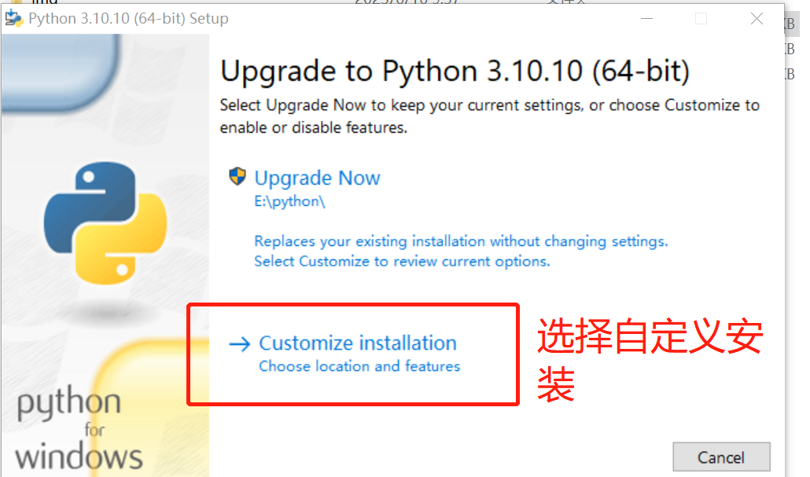

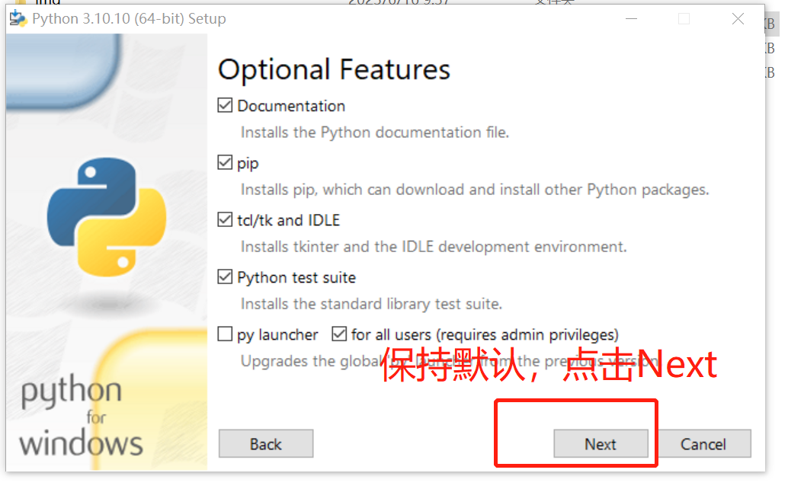

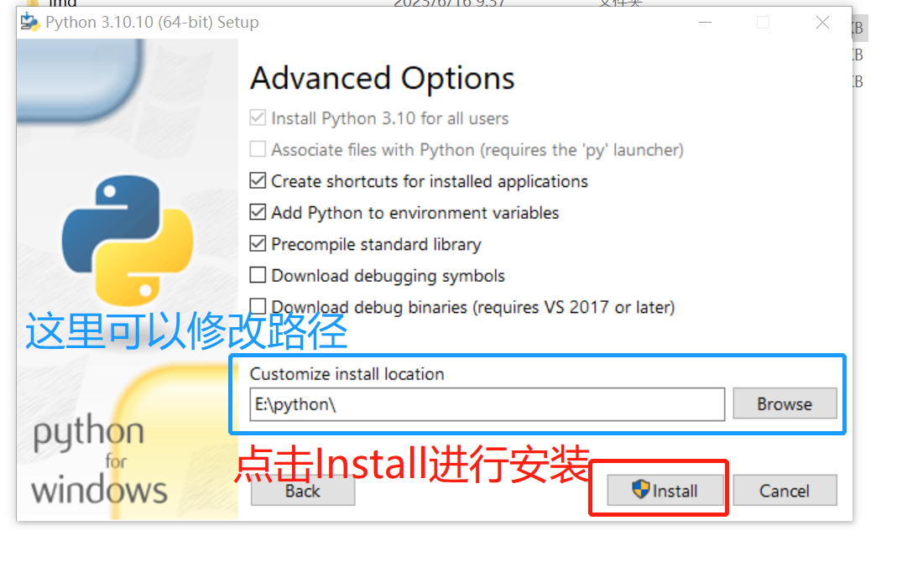

### 3. 检验Python是否安装

首先，你可以通过按`win+R`按键，或者通过桌面状态栏打开命令提示符，如下

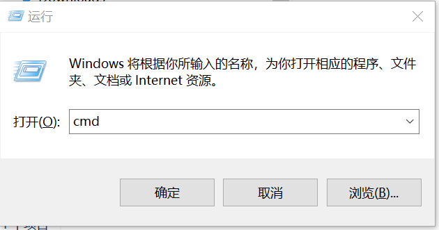

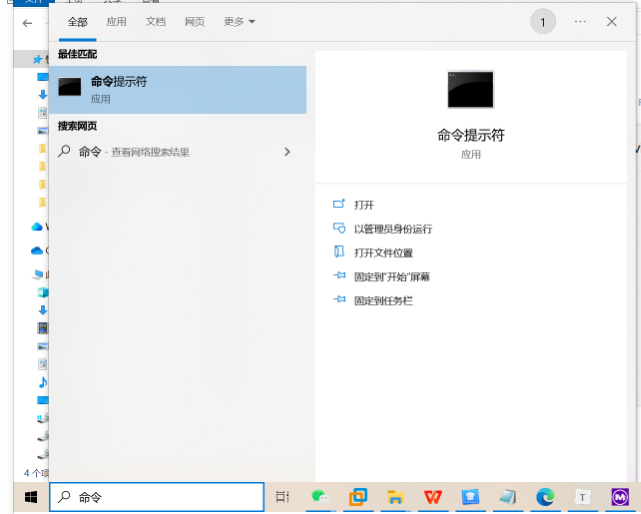

然后输入以下指令

```python
python --version
```

若出现以下界面，则说明Python安装成功

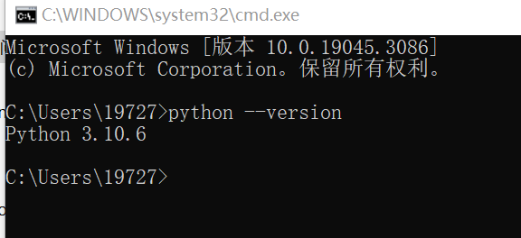

**注意**：因为我之前安装过Python的其他版本了，所以出现的结果是3.10.6，不用在意。

---


## 二. 安装PyCharm

### 1. PyCharm简介

​	PyCharm是一种Python IDE（Integrated Development Environment，集成开发环境），带有一整套可以帮助用户在使用Python语言开发时提高其效率的工具，比如调试、语法高亮、项目管理、代码跳转、智能提示、自动完成、单元测试、版本控制。此外，该IDE提供了一些高级功能，以用于支持Django框架下的专业Web开发。


### 2. 下载资源

您可以复制以下网址到浏览器打开，也可以使用我发送的安装软件

```
https://www.jetbrains.com.cn/pycharm/download/#section=windows
```

如果您通过网站下载的方式，请点击下载社区版
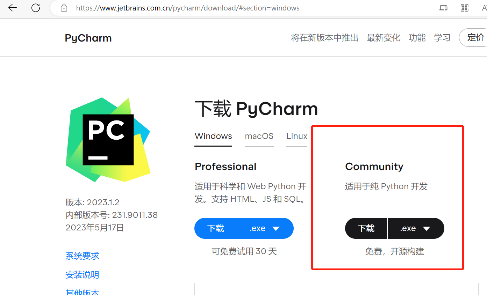


### 3. 安装PyCharm

首先双击您刚刚下载的（或者我发的）exe文件，开始安装

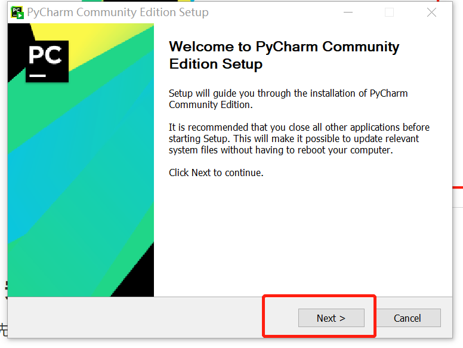

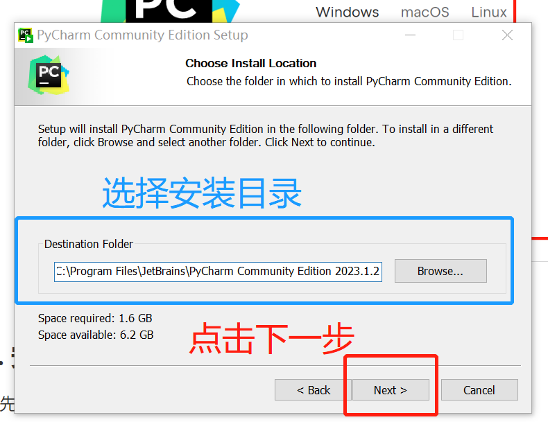

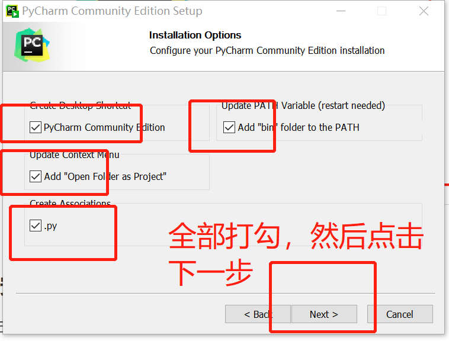

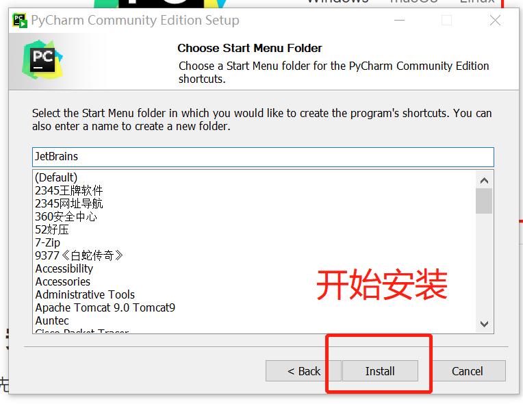

### 4. 打开PyCharm

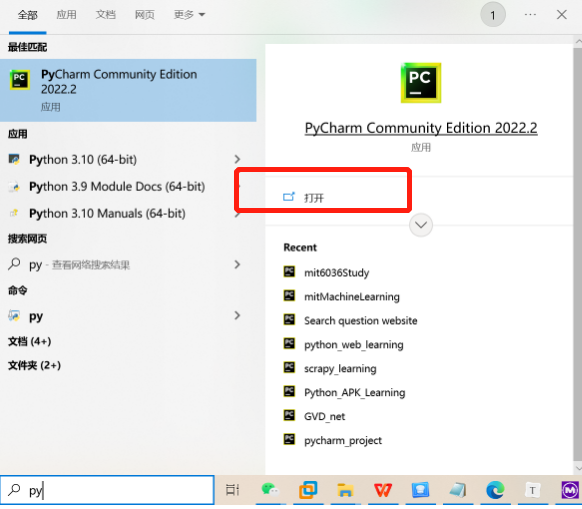

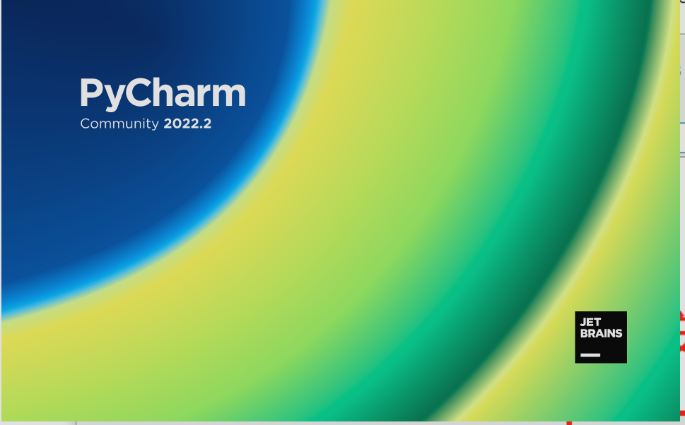

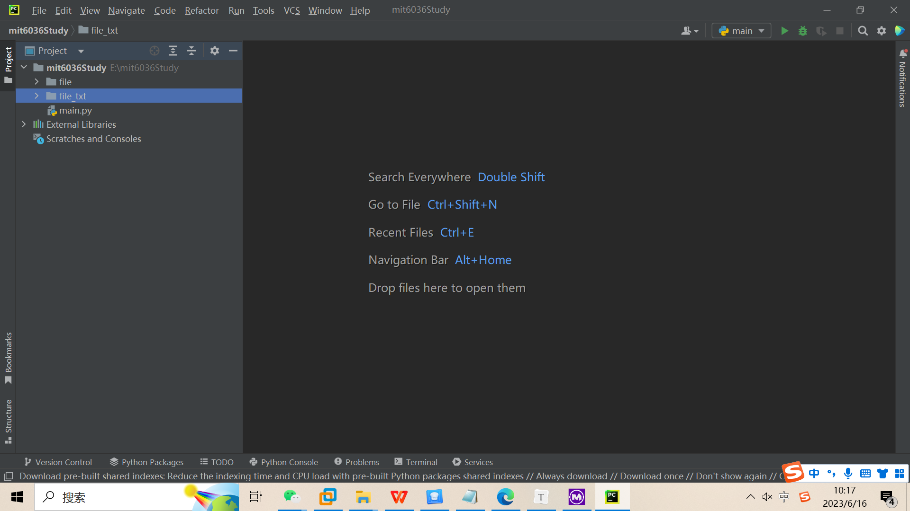

----

## 三. 使用在线环境编译

例如，你可以打开以下网址

```
https://www.nhooo.com/tool/python/?ivk_sa=1024320u
```

进行Python的在线编译

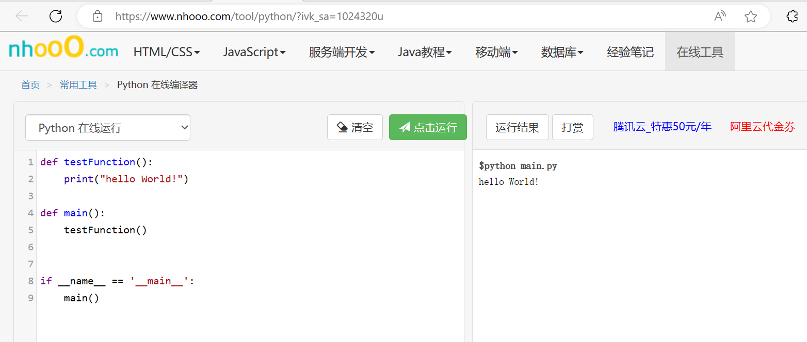

**缺点**： <a style="color:red">没有代码自动补全功能</a>

---


<h4 align="center">END</h4>

